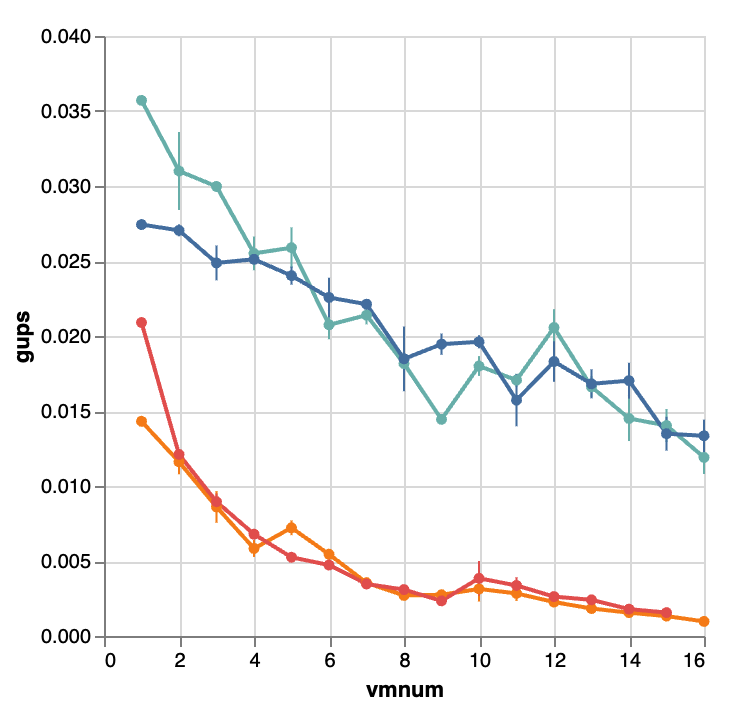
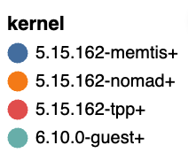

+++
+++
## 0805

今天是八月五号周一. 结束一周的休假, 正式开始继续肝paper了.

目前的情况是休息之前把代码全部整理了一遍. 该重写的重写了; 该commit的commit了; 再也不留一堆在staging area, 改了啥都不知道为啥.

目前我们的优势点还没有通过实验展现, 这个非常影响写作. 要开始写paper还得有些趁手的结果. 目前最有潜力的部分还是多vm场景. 先跑一个多vm看看. 尤其是在用完系统可用DRAM的情况下到底谁更占优势? 这里可以体现出hetero- balloon的优势. 即对比传统virtio-balloon, 我们能够有选择性的resize DRAM以及PMEM. 传统vb没有这个能力, 他只能随机性的resize.

如何展示这一个点? 对比hb固定比例分配DRAM/PMEM和vb无差异化分配DRAM/PMEM?

## 0806

昨天vm镜像出问题, 文件丢失, 搞了一天. 今天回到多vm场景来看.

#### 内存超分下vm的启动

vb和hb在启动时就有很大区别, 我们的启动是: 分配-回收-分配. 因为每次分配都必须按照上限分配, 但是所有vm的内存上限只和是超过系统总内存的. 能否通过在host上开启overcommit绕过这个限制?

结论: 可以. 启动了21个vm. 每个vm启动时会分配32G内存, 启动后通过balloon按比例回收DRAM/PMEM最后保证总体内存占用16G. 启动时32*21=672>384总内存(128+256).

```python
        with ExitStack() as stack:
            vms = [stack.enter_context(Vm(id=id, bench=self)) for id in range(self.num)]
            self._guests = fabric.ThreadingGroup(*map(lambda vm: vm.ip, vms), **vms[0].ssh_config)
            self._guests_wait(vms)
```

另外启动22个vm时, 由于实际内存占用超过了可用内存, 其中一个vm被杀.

#### vb对比hb

多个vm尽管超过了内存总量但也是可以启动了. 那么接下来就应该对比在使用vb和hb时, 多vm的性能情况.

尝试从0-21个vm的情况下, 分别对比使用vb和hb的gups整体性能表现.

- [ ] 需要在测试框架中添加对不同balloon的支持. 目前都是统一使用hb, 先测一组hb. vb支持后再统一测一组vb.

#### 数据处理

report.py改成了从一堆log文件中提取关键metric然后输出成json

|                                  | 0             | 0                 | 0        | 0             | 1             |      | 1                 | 1        | 1             |
| -------------------------------- | ------------- | ----------------- | -------- | ------------- | ------------- | ---- | ----------------- | -------- | ------------- |
|                                  | kernel        | pgmigrate_success | gups     | elapsed       | kernel        |      | pgmigrate_success | gups     | elapsed       |
| 2024-08-06T19:17:46.670399+08:00 | 5.15.162-tpp+ | 2304024           | 0.001096 | 679.790433706 | 5.15.162-tpp+ |      | 1717710           | 0.002830 | 263.314337542 |

## 0807

#### 数据处理

改进以方便画图

|                                  | kernel        | 0                 | 0        | 0             |      | 1                 | 1        | 1             |
| -------------------------------- | ------------- | ----------------- | -------- | ------------- | ---- | ----------------- | -------- | ------------- |
|                                  | nan           | pgmigrate_success | gups     | elapsed       |      | pgmigrate_success | gups     | elapsed       |
| 2024-08-06T19:17:46.670399+08:00 | 5.15.162-tpp+ | 2304024           | 0.001096 | 679.790433706 |      | 1717710           | 0.002830 | 263.314337542 |

#### 画图

- [x] 每个metric画一个均值的line plot
- [ ] 用stdev加上error bar

## 0808

处理网络问题

#### TODO

- [x] 添加对不同balloon的支持
- [x] plot中用stdev加上error bar
- [ ] 想想到底需要什么metric

## 0809

跑实验, 对比balloon.

## 0810

周六, 后台在跑实验, 休息一天打ONI.

## 0811

想下如何组织文章的思路. 正好这几天实验是先跑的多vm scalability测试, 可以先从宏观入手. 然后再根据情况引出我们的每个小设计.



目前看总体上是两梯队, 我们和memtis为第一梯队, tpp和nomad为第二梯队. 我们1和16VM对比性能大概是0.036:0.012, 差距是三倍.  tpp的1和15VM对比大概是0.02:0.0016.

## 0812

看下昨天的virtio-balloon数据, 发现vm为1时最高0.02. 这个应该是纯pmem的数据了, 在host上测测看.

## 0813

下图从左到右分别是guest-hb/guest-vb/host-dram/host-pmem:

<p align="middle">
    
    
    
    
</p>

d):如果将gups乘以vmnum可以发现整体gups基本维持在0.024. 这个是因为pmem的随机访存带宽很有限.

对比c):这个数值是0.11/0.21/0.30/0.37/0.41/0.45/0.48/0.46/0.47/0.47/0.46/0.44/0.33/0.30/0.28/0.27/0.23/0.22; 在6~11vm时plateau, 峰值为7vm时的0.48. 是PMEM的20倍. 后续gups下降原因应该是触碰到了PMEM(128/14≈9.14)的问题. gups峰值出现在这之前, 说明在CPU瓶颈之前DRAM已经瓶颈了.

c)/d)对比能说明虽然PMEM可以来扩容, 但是性能太差, 也是我们着重在VM内部进行设计的motivation. 容量和性能做分离, vm之外管容量问题, vm内部管性能问题.

a)的总gups分别是0.036/0.062/0.090/0.102/0.129/0.124/0.150/0.145/0.130/0.180/0.188/0.247/0.216/0.203/0.210/0.190. 峰值为0.247出现在12vm处. 理论上总gups极限应该是0.48+0.024≈0.5, 目前只发挥了一半.

a)/b)对比能很明显看出hb的优势. 因为vb不能选择性回收内存并且默认优先回收DRAM, 导致性能几乎跟纯PMEM一致.

a)中TPP和Nomad性能太低, 甚至跟vb中无差, 需要确认hb生效情况. 手动运行TPP和Nomad并等待balloon完成resize后, 可用内存分别是4318:10541MB和4321:10544 MB. 这里确认不是balloon的问题.

a)中性能不稳定原因时pebs引入的随机性.

- [ ] a)只到16VM, 理论上DRAM空闲大概在111100也就是vm应该可以到111100/(16/3*1024)=21个. 实际上到17vm时就触发了oom kill. 这样足够么, 调查下是否有vm拿回了部分DRAM.
- [ ] 因为hemem要用到fsdax, 而其他kernel只需要devdax. 这次实验只用了总PMEM容量的一半. 测试全部PMEM的情况.
- [ ] 测试local/remote DRAM的case以模拟cxl下性能表现.
- [ ] 混合不同workload情况?
  - [ ] 测试框架支持
  - [ ] 容量分配算法
- [ ] 量化对比和memtis的性能差距
  - [ ] load/store DRAM hit rate
  - [ ] 使用gups reverse mode观察到底有多少页被迁移
