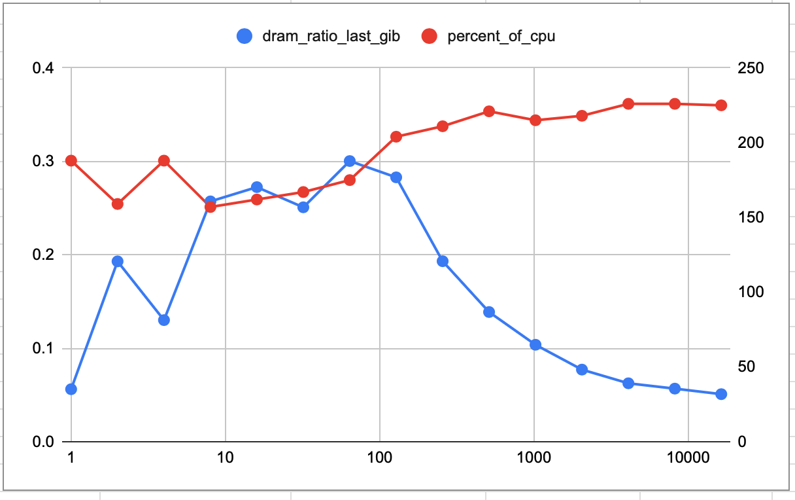

+++
+++
目前exchange可能会与kernel本身的reclamation冲突. 导致某个页可以同时出现在DRAM以及PMEM heap中.

改代码, 在exchange页完毕后加入些判断:

```c
// Althoug in theory the folio could only be
// backed by DRAM or PMEM, in practive, the
// kernel could have done migration in the
// background that we are not aware of.
if (indexable_heap_contains(dheap, pmem_vpfn)) {
 indexable_heap_update(dheap, pmem_vpfn,
         dram_count);
} else {
 indexable_heap_push(dheap, pmem_vpfn,
       dram_count);
}
if (indexable_heap_contains(pheap, dram_vpfn)) {
 indexable_heap_update(pheap, dram_vpfn,
         pmem_count);
} else {
 indexable_heap_push(pheap, dram_vpfn,
       pmem_count);
}
total_exchanges++;
```

另外exchange的失败信息占满dmesg, 在exchange接口外加入一些统计信息后得到如下情况:

```
folio_exchange 21399
folio_exchange_success 13440
folio_exchange_failed 7959
folio_exchange_failed_isolate 5975
folio_exchange_failed_lock 0
folio_exchange_failed_support 1984
folio_exchange_failed_move 0
```

大概成功占2/3, 失败站1/3. 失败的情况中isolate占大头. 这里原因也大概是与reclamation冲突. 在想exchange两个页面的时候其中一个或两者都在被reclamation的LRU便利逻辑检视.

加入一个list和hashtbl来维护当前管理的页面. 在发现一个页面时立即从native LRU中转移到我们的自己list中. 通过hashtbl也可以查询某个页是否被我们管理. 修改后isolate失败的情况基本解决. `_support`的情况是当前管理的页被释放, 不再需要. 这种情况可以无视.

```
folio_exchange 10832
folio_exchange_success 9799
folio_exchange_failed 1033
folio_exchange_failed_isolate 0
folio_exchange_failed_lock 0
folio_exchange_failed_support 1033
folio_exchange_failed_move 0
```

另外统计file folio的占比:

```
pebs_nr_sampled 16722837
pebs_nr_sampled_fmem 3026570
pebs_nr_sampled_smem 11972332
pebs_nr_discarded 1724020 # 10.3%
pebs_nr_discarded_incomplete 85
pebs_nr_discarded_file 1712871 # 99.4%
pebs_nr_discarded_nonlru 11064
pebs_nr_discarded_isolate 0
```

 有10%的sample被忽略, 其中99%都是文件页, 即可以认为文件页总体占比很小, 可以忽略.

目前exchange的页过少9799/512/512=0.0374 GiB. 定期输出我们管理的总页数:

```
[  275.826480] hagent_target_work_fn_policy: collected samples dram=2586946 pmem=12331389 managed=417470 dheap=6866 pheap=401318
[  275.930868] hagent_target_work_fn_policy: collected samples dram=2586970 pmem=12340252 managed=417577 dheap=6870 pheap=401417
[  276.044151] hagent_target_work_fn_policy: collected samples dram=2586999 pmem=12349224 managed=417695 dheap=6881 pheap=401521
[  276.156598] hagent_target_work_fn_policy: collected samples dram=2587015 pmem=12357962 managed=417811 dheap=6880 pheap=401626
[  277.228913] hagent_target_work_fn_policy: get_task_mm()=0000000000000000 failed
[  278.937459] hagent_target_drop: pid=618
[  278.939584] hagent_target_work_drop: cancel_delayed_work_sync(hagent_target_work_policy)
[  278.940382] hagent_target_work_drop: cancel_delayed_work_sync(hagent_target_work_migration)
[  278.944483] hagent_target_unmanage_all: size=417827
```

417827/512/512=1.594  GiB 这个数是大于hotset的大小.

6880/512/512=0.0262 GiB; 401626/512/512=1.532 GiB

尝试改变migration规则, 从dheap top<pheap top => dheap top<=pheap top. 观察结果.

```
[  259.092051] hagent_target_work_fn_policy: collected samples dram=2854535 pmem=12114932 managed=413497 dheap=562 pheap=397081
[  259.198945] hagent_target_work_fn_policy: collected samples dram=2854559 pmem=12123078 managed=413609 dheap=585 pheap=397186
[  259.304234] hagent_target_work_fn_policy: collected samples dram=2854587 pmem=12131911 managed=413726 dheap=611 pheap=397293
[  259.419079] hagent_target_work_fn_policy: collected samples dram=2854604 pmem=12140924 managed=413836 dheap=625 pheap=397396
[  260.848671] hagent_target_drop: pid=612
[  260.850792] hagent_target_work_drop: cancel_delayed_work_sync(hagent_target_work_policy)
[  260.851622] hagent_target_work_drop: cancel_delayed_work_sync(hagent_target_work_migration)
[  260.855858] hagent_target_unmanage_all: size=413896
```

dheap页大幅下降. 撤回修改.

尝试增大batch size. 如果batch size增大后dheap还是不增长则说明sds的参数设置有问题.

```
[  261.115795] hagent_target_work_fn_policy: collected samples dram=2172125 pmem=12769138 managed=414243 dheap=6713 pheap=398329
[  261.218465] hagent_target_work_fn_policy: collected samples dram=2172141 pmem=12778267 managed=414343 dheap=6721 pheap=398425
[  261.330908] hagent_target_work_fn_policy: collected samples dram=2172154 pmem=12787191 managed=414434 dheap=6727 pheap=398512
[  261.454269] hagent_target_work_fn_policy: collected samples dram=2172175 pmem=12796054 managed=414540 dheap=6728 pheap=398607
[  264.045262] hagent_target_drop: pid=616
[  264.047326] hagent_target_work_drop: cancel_delayed_work_sync(hagent_target_work_policy)
[  264.048125] hagent_target_work_drop: cancel_delayed_work_sync(hagent_target_work_migration)
[  264.052280] hagent_target_unmanage_all: size=414613
```

dheap大小基本不变.

尝试增大sds的尺寸让其更逼近简单的counter array. 4x8192 => 8x16384

```
[  261.339940] hagent_target_work_fn_policy: collected samples dram=3364374 pmem=11568024 managed=414269 dheap=7132 pheap=399375
[  261.454035] hagent_target_work_fn_policy: collected samples dram=3364590 pmem=11576522 managed=414378 dheap=7141 pheap=399480
[  261.568672] hagent_target_work_fn_policy: collected samples dram=3364781 pmem=11585262 managed=414487 dheap=7152 pheap=399580
[  261.675392] hagent_target_work_fn_policy: collected samples dram=3364981 pmem=11593793 managed=414599 dheap=7148 pheap=399680
[  261.783644] hagent_target_work_fn_policy: collected samples dram=3365186 pmem=11602448 managed=414708 dheap=7153 pheap=399784
[  262.943669] hagent_target_work_fn_policy: get_task_mm()=0000000000000000 failed
[  263.645542] hagent_target_drop: pid=616
[  263.647581] hagent_target_work_drop: cancel_delayed_work_sync(hagent_target_work_policy)
[  263.648384] hagent_target_work_drop: cancel_delayed_work_sync(hagent_target_work_migration)
[  263.652591] hagent_target_unmanage_all: size=414764
```

有效果, 但是不明显. 尝试更换decaying函数, 尝试关闭decaying.

```
[  274.171216] hagent_target_work_fn_policy: collected samples dram=358251 pmem=14586247 managed=415712 dheap=222 pheap=10303
[  274.284362] hagent_target_work_fn_policy: collected samples dram=358272 pmem=14595329 managed=415829 dheap=222 pheap=10314
[  274.404274] hagent_target_work_fn_policy: collected samples dram=358286 pmem=14604157 managed=415923 dheap=222 pheap=10318
[  274.511131] hagent_target_work_fn_policy: collected samples dram=358305 pmem=14612872 managed=416042 dheap=222 pheap=10321
[  276.962595] hagent_target_drop: pid=620
[  276.964624] hagent_target_work_drop: cancel_delayed_work_sync(hagent_target_work_policy)
[  276.965703] hagent_target_work_drop: cancel_delayed_work_sync(hagent_target_work_migration)
[  276.966568] hagent_target_unmanage_all: size=416078
```

dheap大小大幅降低, 尝试一直decaying?

```
[  263.745160] hagent_target_work_fn_policy: collected samples dram=3509128 pmem=11427434 managed=414437 dheap=523 pheap=401606
[  266.364201] hagent_target_drop: pid=622
[  266.366281] hagent_target_work_drop: cancel_delayed_work_sync(hagent_target_work_policy)
[  266.367244] hagent_target_work_drop: cancel_delayed_work_sync(hagent_target_work_migration)
[  266.371670] hagent_target_unmanage_all: size=414506
```

这样也不行.

允许dram heap中存在访问数为0(一般出现在decay之后)的页.

```
[  278.774643] hagent_target_work_fn_policy: collected samples dram=2612540 pmem=12303815 managed=417852 dheap=7373 pheap=399978
[  278.869353] hagent_target_work_fn_policy: collected samples dram=2612611 pmem=12312509 managed=417939 dheap=7380 pheap=400061
[  278.968906] hagent_target_work_fn_policy: collected samples dram=2612627 pmem=12321878 managed=418065 dheap=7387 pheap=400183
[  280.136162] hagent_target_work_fn_policy: get_task_mm()=0000000000000000 failed
[  281.946885] hagent_target_drop: pid=617
[  281.948947] hagent_target_work_drop: cancel_delayed_work_sync(hagent_target_work_policy)
[  281.949707] hagent_target_work_drop: cancel_delayed_work_sync(hagent_target_work_migration)
[  281.953857] hagent_target_unmanage_all: size=418126
```

dheap稍微增长

在iheap被destroy的时候看看情况

```
[  306.597471] indexable_heap size=6638 dumping first n=6638:
[  306.603041]  (0x7fe825f74, 1) (0x7feb3d833, 32767) (0x7fe81019b, 1) (0x7fe860f0b, 32767) (0x7feb32d66, 32767) (0x7fe86a266, 1) (0x7feb3eb3c, 32767) (0x7fe84f24e, 32767) (0x7feb12a90, 32767)
 (0x7feb21369, 32767) (0x7feb381b2, 32767) (0x7fe865430, 1) (0x7fe86de49, 32767) (0x7feb33f6a, 32767) (0x7feb2e496, 32767) (0x7feb2c23c, 32767) (0x7fe851032, 32767) (0x7feb2f143, 32767) (0x7fe
8406b7, 32767) (0x7feb19c5d, 32767) (0x7feb288a2, 32767) (0x7fe820a33, 32767) (0x7fe85bf7e, 32767) (0x7fe80d7f6, 32767) (0x7fe84285e, 1) (0x7fe81c267, 32767) (0x7feb370ed, 32767) (0x7feb1f421,
 32767) (0x7feb30b4a, 32767) (0x7feb1da37, 32767) (0x7feb10619, 32767) (0x7fe850677, 32767) (0x7feb3a2cf, 32767) (0x7fe871eef, 32767) (0x7feb1f135, 32767) (0x7feb3a399, 32767) (0x7fe84649d, 32
767) (0x7feb30609, 32767) (0x7feb25bcd, 32767) (0x7feb3991a, 32767) (0x7feb2ba38, 32767) (0x7feb20883, 32767) (0x7feb3f4ed, 32767) (0x7feb15447, 32767) (0x7feb32ac1, 32767) (0x7fe83263a, 32767
) (0x7fe82336b, 32767) (0x7feb2ee2f, 32767) (0x7feb2c9d3, 32767)
[  306.603078]  (0x7feb0f10e, 32767) (0x7fe82a8dc, 32767) (0x7feb0dd8b, 32767) (0x7feb492de, 32767) (0x7fe8438e3, 32767) (0x7feb41183, 32767) (0x7feb1a64a, 32767) (0x7feb3322c, 32767) (0x7feb1
45dc, 32767) (0x7fe83bb89, 32767) (0x7feb42e34, 32767) (0x7fe82803f, 32767) (0x7fe83d18c, 32767) (0x7feb132e6, 32767) (0x7feb1d83f, 32767) (0x7feb3a254, 32767) (0x7fe82c74b, 32767) (0x7feb1c7b
0, 32767) (0x7feb0b921, 32767) (0x7feb12082, 32767) (0x7fe814654, 32767) (0x7feb171bd, 32767) (0x7fe82eba5, 32767) (0x7feb1b585, 32767) (0x7feb1f3e7, 32767) (0x7fe819159, 32767) (0x7feb44a64,
32767) (0x7feb33a64, 32767) (0x7feb210cc, 32767) (0x7fe838188, 32767) (0x7fe8357e4, 32767) (0x7feb4a29e, 32767) (0x7feb18bc9, 32767) (0x7feb3f330, 32767) (0x7feb377b3, 32767) (0x7fe80c639, 327
67) (0x7feb36dc2, 32767) (0x7feb17d07, 32767) (0x7fe8685e0, 32767) (0x7fe84af69, 32767) (0x7feb2530a, 32767) (0x7feb494c3, 32767) (0x7feb4106d, 32767) (0x7feb422ea, 32767) (0x7feb49840, 32767)
 (0x7feb15b56, 32767) (0x7feb11a00, 32767) (0x7fe86af2d, 32767)
```

出现32767, 疑似有溢出.

检查代码发现我用的是u16, 最大是65535, 没有溢出. 目前看只是访问次数过多, decaying概率指数下降, 由于用了int模拟float导致概率为0. 能否使用zipf让访问更有区分度?

尝试zipf

```
[  290.543428] indexable_heap size=2430 dumping first n=2430:
[  290.547130]  (0x7fb5ae3c5, 1) (0x7fb5a6f0b, 1) (0x7fb5dafaa, 32767) (0x7fb5a51ac, 1) (0x7fb5c9f78, 32767) (0x7fb5ed704, 32767) (0x7fb8c5e7c, 32767) (0x7fb5d2214, 32767) (0x7fb5cf58d, 1) (0x
7fb8cccd0, 32767) (0x7fb8c033e, 32767) (0x7fb5b99d9, 32767) (0x7fb8c48f3, 32767) (0x7fb8cb18b, 32767) (0x7fb5cd92b, 32767) (0x7fb8c7f3a, 32767) (0x7fb8cc227, 32767) (0x7fb5b9c3c, 5156) (0x7fb8
c84ce, 32767) (0x7fb8c948b, 32767) (0x7fb8c5ab4, 32767) (0x7fb8c30cd, 32767) (0x7fb5d7c39, 32767) (0x7fb5cf7c7, 32767) (0x7fb81b785, 32767) (0x7fb8b673b, 32767) (0x7fb8caaa3, 32767) (0x7fb8ca0
4c, 32767) (0x7fb8c82be, 32767) (0x7fb8c9d98, 32767) (0x7fb5e6c95, 32767) (0x7fb8ccba3, 32767) (0x7fb8cae86, 32767) (0x7fb877ac9, 32767) (0x7fb8ca61f, 32767) (0x7fb797311, 32767) (0x7fb8c942f,
 32767) (0x7fb5e4abc, 32767) (0x7fb8c97de, 32767) (0x7fb5eeb3d, 32767) (0x7fb8c87c6, 32767) (0x7fb8c9053, 32767) (0x7fb5e57a4, 32767) (0x7fb894ba9, 32767) (0x7fb8c849b, 32767) (0x7fb5a0c85, 32
767) (0x7fb7f85bb, 32767) (0x7fb7d885e, 32767) (0x7fb8cb599, 32767)
[  290.547166]  (0x7fb8ae310, 32767) (0x7fb8ca6f8, 32767) (0x7fb8c7a54, 32767) (0x7fb8c8ed1, 32767) (0x7fb8ca09a, 32767) (0x7fb5caded, 32767) (0x7fb8cacdf, 32767) (0x7fb5a8e5a, 32767) (0x7fb8b
c941, 32767) (0x7fb8ca6bf, 32767) (0x7fb5aebb3, 32767) (0x7fb5b1ff5, 32767) (0x7fb8c576f, 32767) (0x7fb8cbef7, 32767) (0x7fb8ca219, 32767) (0x7fb8cca6c, 32767) (0x7fb8c8cb6, 32767) (0x7fb8b34c
c, 32767) (0x7fb8c8e2f, 32767) (0x7fb5d9dc0, 32767) (0x7fb8b4f86, 32767) (0x7fb5b1037, 32767) (0x7fb5c032d, 32767) (0x7fb8c9110, 32767) (0x7fb8365f2, 32767) (0x7fb8b5540, 32767) (0x7fb8c55d6,
32767) (0x7fb8cc8f4, 32767) (0x7fb8cc8bc, 32767) (0x7fb6b7d2d, 32767) (0x7fb5db1cb, 32767) (0x7fb8ccdef, 32767) (0x7fb800e6e, 32767) (0x7fb8cc085, 32767) (0x7fb5c017f, 32767) (0x7fb8bd94e, 327
67) (0x7fb846d96, 32767) (0x7fb5be665, 32767) (0x7fb8c5906, 32767) (0x7fb8c8bec, 32767) (0x7fb8cc848, 32767) (0x7fb8c42c6, 32767) (0x7fb8caa0f, 32767) (0x7fb8c3499, 32767) (0x7fb8b53df, 32767)
 (0x7fb8cbfcc, 32767) (0x7fb8c894a, 32767) (0x7fb8cadc8, 32767)
```

发现dheap大小反而下降.

dheap中基本没有cold folio. 能否增大其被发现的概率? 尝试增大dram的profiling力度. 即额外增加一个local dram load事件.

```
[  332.839223] indexable_heap size=11701 dumping first n=11701:
[  332.840762]  (0x7f70c276e, 1) (0x7f710392d, 1) (0x7f73f3a48, 32767) (0x7f73cd306, 32767) (0x7f7114fdf, 1) (0x7f73e0f53, 32767) (0x7f70cb15c, 32767) (0x7f73ea49e, 32767) (0x7f73b69d2, 32767)
 (0x7f73c0cc3, 32767) (0x7f70ba547, 1) (0x7f73e65c0, 32767) (0x7f73eee0b, 32767) (0x7f73d8a85, 32767) (0x7f73cb043, 32767) (0x7f73ed63f, 32767) (0x7f73eb1fc, 32767) (0x7f73c5295, 32767) (0x7f7
3ef5a1, 32767) (0x7f70e4e6c, 32767) (0x7f70bc5a0, 32767) (0x7f70c27bf, 1) (0x7f73e760a, 32767) (0x7f73dad5a, 32767) (0x7f70d1243, 32767) (0x7f73dc8f8, 32767) (0x7f70bcc97, 32767) (0x7f73d04cb,
 32767) (0x7f73baa29, 32767) (0x7f73d36ff, 32767) (0x7f70f857a, 32767) (0x7f73dbf44, 32767) (0x7f70dc67a, 32767) (0x7f73f07d6, 32767) (0x7f73e01e8, 32767) (0x7f73b76df, 32767) (0x7f70fbd0b, 32
767) (0x7f73bb053, 32767) (0x7f70c4f92, 32767) (0x7f73babe3, 32767) (0x7f70f9c0c, 32767) (0x7f73e5bf3, 32767) (0x7f73c000b, 32767) (0x7f73eba5c, 32767) (0x7f70d8f13, 1) (0x7f73e0864, 32767) (0
x7f73d63b6, 32767) (0x7f73dfdb2, 32767) (0x7f73e6755, 32767)
[  332.840799]  (0x7f73f47d6, 32767) (0x7f73e18c6, 32767) (0x7f73e5a65, 32767) (0x7f73b5832, 32767) (0x7f70c9b58, 32767) (0x7f73eb045, 32767) (0x7f70c124b, 32767) (0x7f70f454d, 32767) (0x7f73e
ad2e, 32767) (0x7f73efc88, 32767) (0x7f73ec6ae, 32767) (0x7f73cbacb, 32767) (0x7f73db33f, 32767) (0x7f73c01b5, 32767) (0x7f739db31, 32767) (0x7f73dab56, 32767) (0x7f73d355c, 32767) (0x7f73e02d
2, 32767) (0x7f73f0da0, 32767) (0x7f73e5461, 32767) (0x7f73ceaf8, 32767) (0x7f73f3460, 32767) (0x7f73c7652, 32767) (0x7f73c0510, 32767) (0x7f73dc2ad, 32767) (0x7f73e0eca, 32767) (0x7f73ddd97,
32767) (0x7f73ca65d, 32767) (0x7f711359b, 32767) (0x7f70be6f0, 32767) (0x7f73ef307, 32767) (0x7f73ec46b, 32767) (0x7f73f153d, 32767) (0x7f73bbe5c, 32767) (0x7f73ee2d5, 32767) (0x7f73ee35e, 327
67) (0x7f70eac36, 32767) (0x7f73dad2e, 32767) (0x7f73b86b8, 32767) (0x7f73dd879, 32767) (0x7f73bb41b, 32767) (0x7f711641a, 1) (0x7f73f158d, 32767) (0x7f70e673e, 32767) (0x7f73d967c, 32767) (0x
7f73c6ea6, 32767) (0x7f70ebbc7, 32767) (0x7f73d4e5e, 32767)
```

这个方法奏效, dheap从6~7k增大到了11k

尝试降低整体的sampling frequency, 这样可以避免decaying指数下降的问题.

```
[  296.991510] indexable_heap size=6407 dumping first n=6407:
[  296.993720]  (0x7f24ddc7b, 1) (0x7f28055e6, 32767) (0x7f2533ace, 1) (0x7f27f6b60, 32767) (0x7f27eb8c0, 32767) (0x7f25273d4, 1) (0x7f24f7b0a, 32767)
 (0x7f27f1528, 32767) (0x7f27e8180, 32767) (0x7f27fda98, 32767) (0x7f280cfc8, 32767) (0x7f253eff1, 1) (0x7f27db573, 32767) (0x7f250096b, 32767) (0x7f2
501282, 32767) (0x7f253d081, 32767) (0x7f2809b5d, 32767) (0x7f27e5eaf, 32767) (0x7f28086d3, 32767) (0x7f2810f9c, 32767) (0x7f27f949d, 32767) (0x7f2809
96e, 32767) (0x7f2522c17, 32767) (0x7f2531320, 1) (0x7f2521c4a, 1) (0x7f24d6616, 32767) (0x7f2807826, 32767) (0x7f280aeef, 32767) (0x7f27ee8ac, 32767)
 (0x7f28021a5, 32767) (0x7f280835c, 32767) (0x7f28050c6, 32767) (0x7f280ddee, 32767) (0x7f2525b02, 32767) (0x7f27d95d6, 32767) (0x7f280e0a5, 32767) (0
x7f27ec4d1, 32767) (0x7f2815236, 32767) (0x7f27f4b14, 32767) (0x7f27df3e7, 32767) (0x7f280215f, 32767) (0x7f280b6cd, 32767) (0x7f2810cfe, 32767) (0x7f
27f2be2, 32767) (0x7f28033c6, 32767) (0x7f2529094, 32767) (0x7f27e7762, 32767) (0x7f2808f34, 32767) (0x7f253d359, 1) (0x7f24d0f69, 1)
[  296.993757]  (0x7f28123af, 32767) (0x7f28087d8, 32767) (0x7f27fd9e0, 32767) (0x7f2801744, 32767) (0x7f27ff10f, 32767) (0x7f280de3e, 32767) (0x7f280
f000, 32767) (0x7f2815813, 32767) (0x7f27f2827, 32767) (0x7f2808054, 32767) (0x7f27f6f60, 32767) (0x7f27fc5c0, 32767) (0x7f27f420d, 32767) (0x7f2807cd
4, 32767) (0x7f28058f9, 32767) (0x7f2805f63, 32767) (0x7f27ed3be, 32767) (0x7f27e12ae, 32767) (0x7f280ef8e, 32767) (0x7f27e50fb, 32767) (0x7f27db43d,
32767) (0x7f280d806, 32767) (0x7f27d7fa9, 32767) (0x7f250aa0f, 32767) (0x7f27f3a0e, 32767) (0x7f27fe95f, 32767) (0x7f2810901, 32767) (0x7f27ffd04, 327
67) (0x7f27dbf5f, 32767) (0x7f27e53e6, 32767) (0x7f280357d, 32767) (0x7f27fb0e6, 32767) (0x7f27e2ddc, 32767) (0x7f280d96c, 32767) (0x7f27db62d, 32767)
 (0x7f25389ae, 32767) (0x7f27e94a5, 32767) (0x7f27fdccf, 32767) (0x7f27fd5db, 32767) (0x7f27fc20f, 32767) (0x7f27f7691, 32767) (0x7f2511be1, 32767) (0
x7f27ff2a0, 32767) (0x7f24f87fc, 32767) (0x7f27f08cd, 32767) (0x7f280b58e, 32767) (0x7f280dbbe, 32767) (0x7f27f6f3a, 32767)
```

这里把load latency事件关闭了, 并且frequency降低到一半, 仍然可以保持基本一致的dheap size.

目前来看需要两种event, 一个idle event, 抓取一个背景访存. 另一个dram specific的event, 来抓取dram cold page.

和上次一样, 尝试只使用all store和dram load事件. 不过可以再以sampling period做个区分.

```
[  312.578593] indexable_heap size=6444 dumping first n=6444:
[  312.582188]  (0x7f1122192, 1) (0x7f13dd7ff, 32767) (0x7f1117abd, 1) (0x7f111f769, 32767) (0x7f13f9c5e, 32767) (0x7f10b9abd, 1) (0x7f13d2063, 32767)
 (0x7f13cda94, 32767) (0x7f13cab02, 32767) (0x7f13e92cb, 32767) (0x7f13d97d3, 32767) (0x7f13f7f13, 32767) (0x7f13f3844, 32767) (0x7f13d3806, 32767) (0
x7f13e6c7d, 32767) (0x7f1122c55, 32767) (0x7f13d0ae5, 32767) (0x7f13e8c53, 32767) (0x7f13cf342, 32767) (0x7f13eabee, 32767) (0x7f13d4230, 32767) (0x7f
13c8aac, 32767) (0x7f13f09d2, 32767) (0x7f13dbcb4, 32767) (0x7f13e8fe1, 32767) (0x7f13c5e66, 32767) (0x7f13d8701, 32767) (0x7f13c3a8d, 32767) (0x7f13f
c64f, 32767) (0x7f13ed65e, 32767) (0x7f13ee3ad, 32767) (0x7f13cd91e, 32767) (0x7f13ed862, 32767) (0x7f110bf78, 32767) (0x7f13c4a2f, 32767) (0x7f13f0e1
0, 32767) (0x7f13f4ac5, 32767) (0x7f13c797e, 32767) (0x7f13dfc1f, 32767) (0x7f13d7eb4, 32767) (0x7f13d15ff, 32767) (0x7f13cef2c, 32767) (0x7f13e7011,
32767) (0x7f13f915f, 32767) (0x7f13d70d2, 32767) (0x7f13e914d, 32767) (0x7f13c028e, 32767) (0x7f13e4531, 32767) (0x7f13d4042, 32767)
[  312.582222]  (0x7f13fb9da, 32767)
```

all store period = 16384; dram load period = 8192; 结果dheap大小基本不变. 比较下cpu使用率240->230???问什么降低???尝试将period增大十倍. 增大十倍后cpu使用率仍然只有265????

问题在于dram ratio profiling? 关闭试试? 关闭后仍然只有 261. 排除.

关闭hagent之后, 上升到331. 所以hagent消耗了~60%的cpu. 这个等下解决, 先看看是不是event足够多, 我们就能到足够准确.

尝试增大event frequency十倍. 增大十倍后dheap大小为97610, 有显著上升, 但是似乎migration几乎没有发生. 怀疑是sampling抢占了migration到cpu time. 同时gups的cpu time也滑落到184.

测一个sample frequency/dram ratio的曲线.  [google sheet](https://docs.google.com/spreadsheets/d/1sHr_B8iwL6RRAH0GF552mMDQJKnLqWx5eBhfuTiZKKg/)



结论是在128的时候dram ratio最大. 同时CPU的损耗其实并没有收到太大影响.

| freq  | ratio       | cpu time |
| ----- | ----------- | -------- |
| 1     | 0.056159817 | 188      |
| 2     | 0.193007547 | 159      |
| 4     | 0.130136065 | 188      |
| 8     | 0.25717713  | 157      |
| 16    | 0.27245989  | 162      |
| 32    | 0.250848722 | 167      |
| 64    | 0.300376398 | 175      |
| 128   | 0.282929061 | 204      |
| 256   | 0.193166396 | 211      |
| 512   | 0.13876746  | 221      |
| 1024  | 0.103722842 | 215      |
| 2048  | 0.07713039  | 218      |
| 4096  | 0.062487745 | 226      |
| 8192  | 0.056778817 | 226      |
| 16384 | 0.05088499  | 225      |

突然发现一个问题: launcher和time实际上有冲突, time会记录launcher所花的时间, 包括打印大量的debug信息.
