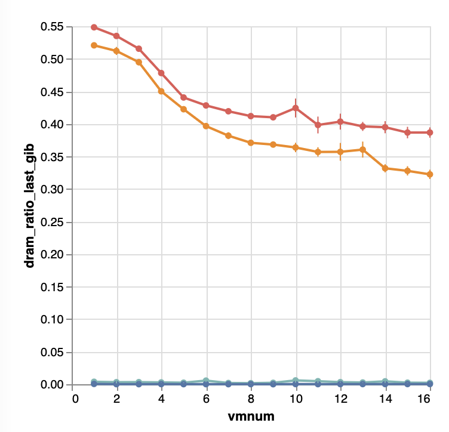
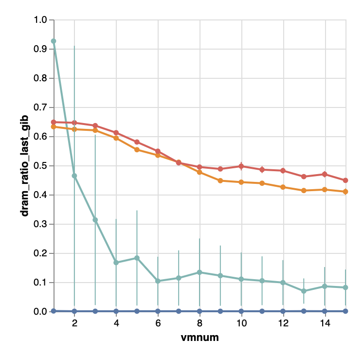

+++
+++
目前观察到的几个现象以及猜想:

1. Overall性能表现我们和TPP一档, SMEM为PMEM时TPP好, RDRAM时我们好.
2. 我们的开销最低, 应用分到的CPU时间最多.
   - 怀疑主要的开销是在页表相关管理: Memtis的访存信息存在页表的关联结构中; TPP/Nomad需要频繁修改页表来trigger hint fault.
   - tlb有相关的tracepoint: `tracepoint:tlb:tlb_flush(int reason, unsigned long pages)`.
     - [ ] 能否追踪TLB shoot down和walk page table的时间?
       - [ ] TLB shoot down暂时先只记录出现次数
       - [ ] 通过funclat profile `change_prot_numa()`可以得到unmap page table所花时间. page fault 硬件所花时间暂时没法得到. page fault总共软件用时可以通过`handle_mm_fault()`得到.
       - [ ] memtis中通过`__update_pginfo()`walk page table然后将访存信息更新到页表中同时决定是否需要activate page
     - [ ] 检测周期还是时间? 需不需要要定死CPU frequency (全核3.0)?
3. 我们的migration并没有显出效果. Hotset的DRAM占比我们基本可以忽略不计, 而TPP/Nomad可以做到50%+.
   - 如何量化?
4. Sample存在DRAM bias. 对于R-DRAM, DRAM sample更多, 但是倍数不高; 对于PMEM, DRAM sample多很多, 倍数很高(>5).
   - 这个Bias对我们以堆为准对热度检测有影响吗?
5. Memtis总sample和FMEM/SMEM之和对不上.
   - 我们和Memtis在记录总sample数之前都过滤掉了地址无效的sample.
   - 这里怀疑是pgtbl lock contention. 检测方法可以用ftrace. `mmap_read_trylock()`有对应的`tracepoint:mmap_lock:mmap_lock_acquire_returned(struct mm_struct *mm, const char *memcg_path, bool write, bool success)`.
     - [x] Host kernel需要开启[`CONFIG_IKHEADERS`](https://cateee.net/lkddb/web-lkddb/IKHEADERS.html)
     - [ ] 看看检测DRAM ratio的方法对pgtbl lock contention的影响
6. PMEM下Memtis的性能并不稳定. 比较前面跑的, 这次elapsed明显在3/6/11时有波动. 峰值基本上是两倍关系.

目前加上了fault time + tlb + mmap_read_lock contention profiling但是出现了严重bug, 我们的实现中经常出现panic. 猜测是由于引入的profiler让内存压力提高, reclamation与我们的管理相冲突. 现在暂时先暂停实验, 先修好我们设计上的缺陷. 目前主要问题是LRU和我们的管理相冲突. 考虑加入一个独立于LRU的结构, 如果一个页接受我们的管理, 则他会被从LRU中转移到该结构.

这个结构需要支持:

- [x] 查询(by vpfn)某个页存在其中与否
  - hashtbl: vpfn -> folio
- [x] 查找/删除
- [x] 维护页的访问次数并据此排出冷热
  - sds: vpfn -> frequency
  - iheap: vpfn -> frequency
- [x] 页迁移(交换)
  - 交换两层iheap的顶
  - 因为用了va, sds不用动
  - hashtbl更新
- [x] deallocation会产生什么影响?
- [x] Locking?

需要能通过struct folio判断是否属于我们的结构.

限制

- private anon only

另外大部分测试都会在iheap的swap中出错, 且日志中都紧跟着exchange, 怀疑exchange问题. 关闭后再跑看.

1732   │ [   97.318296] CWISS_CHECK failed at mm/hagent/indexable_heap.h:149
1733   │ [   97.319732] getting a non-existant entry via keyy from the map keyx=0x7f18273cb valx=8505 keyy=0x7f184d737

经过一系列的debug assertion, 发现这里的原因是`cwisstable`的`insert`接口其实不支持`update`. `insert`只会插入不存在的key, 如果key已经存在, 则返回其所在的entry. 所以我们在处理`update`的时候需要手动设置entry中的value.

修完后, 发现hotset的DRAM ratio直线上升到90%. 说明我的双堆设计非常有效. 但是在VM多的情况下下降直接原因是migration有大量失败(dmesg中被填满了失败的错误信息). 目前推测主要的影响因素是我们的管理和Linux原生LRU冲突. 应该在我们接管时从LRU中分离出来.

 
