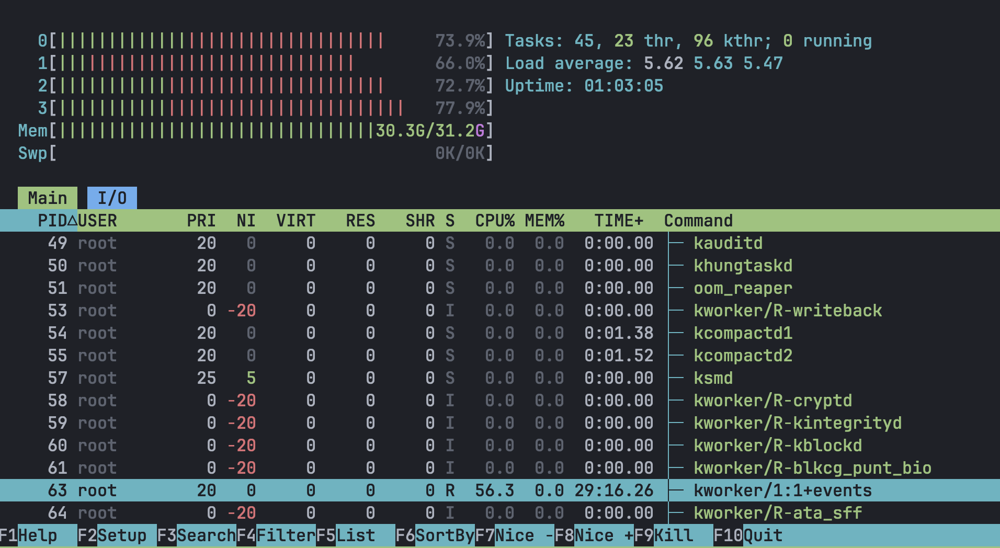
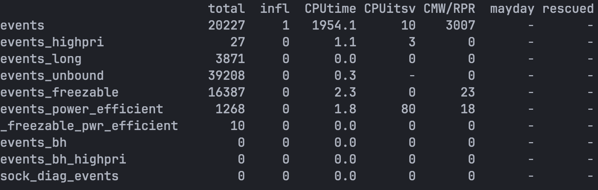

+++
+++

我们的policy work item一直占用约60%CPU, 开销太大. 相比之下migration work item是在highpri wq上执行, 所用的时间几乎可以忽略不计.

policy work item负责从ringbuf中拿出work sample, 更新和维护统计hotness的数据结构, 以及enqueue migration work.

目前看根本的原因还是sample太多, 处理不过来. 想尝试在policy work item中获取自己的CPU占用情况, 并据此更改event的sample frequency. 目前在[kernel doc](https://docs.kernel.org/core-api/workqueue.html)中并没有发现相关的支持. 考虑手搓一个, 即wrap我们自己的work item. 在这个wrapper中记录所消耗的时间和wall clock time, 从而计算出CPU占用情况. 如果过高则考虑缩减event frequency. 另外需要缩减frequency的情况还包括ringbuf出现wrap around. 这种情况也说明需要处理完全部的sample所需的CPU占用会太高.

关于统计CPU使用情况的方法可以借鉴memtis的实现. 但是区别在于他能够原生的从``struct task_struct`中获取scheduler记录的信息(包括`t->se.sum_exec_runtime`), 我们并不能, 我们只能自己维护相对应的信息.
