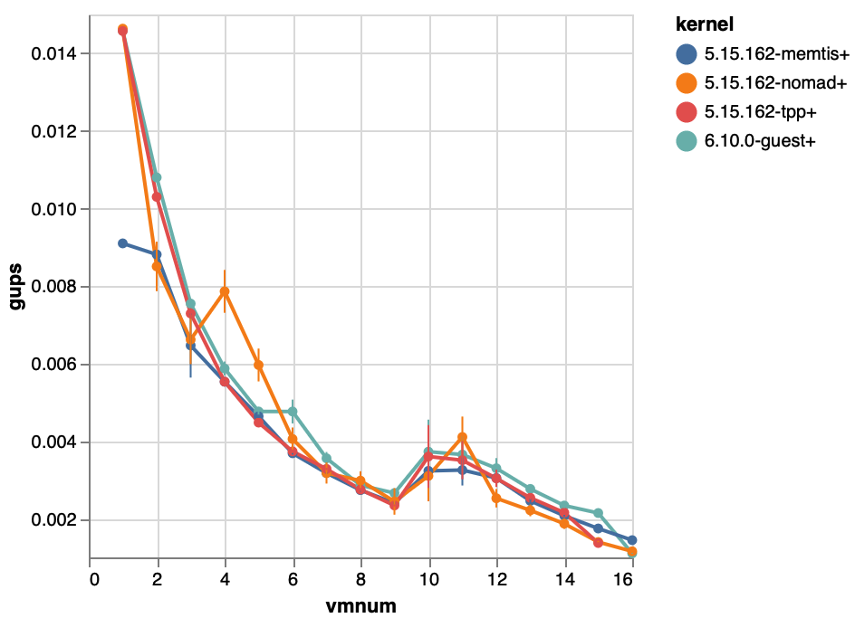
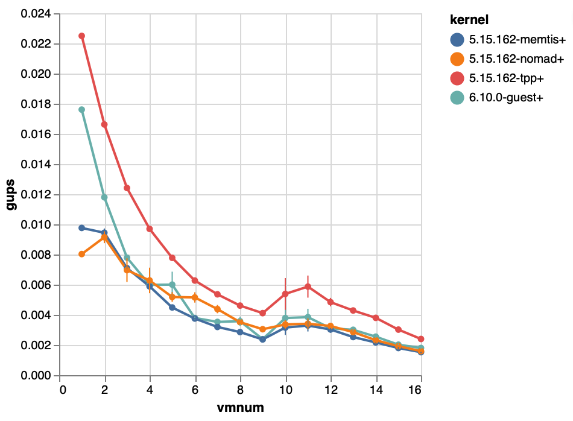
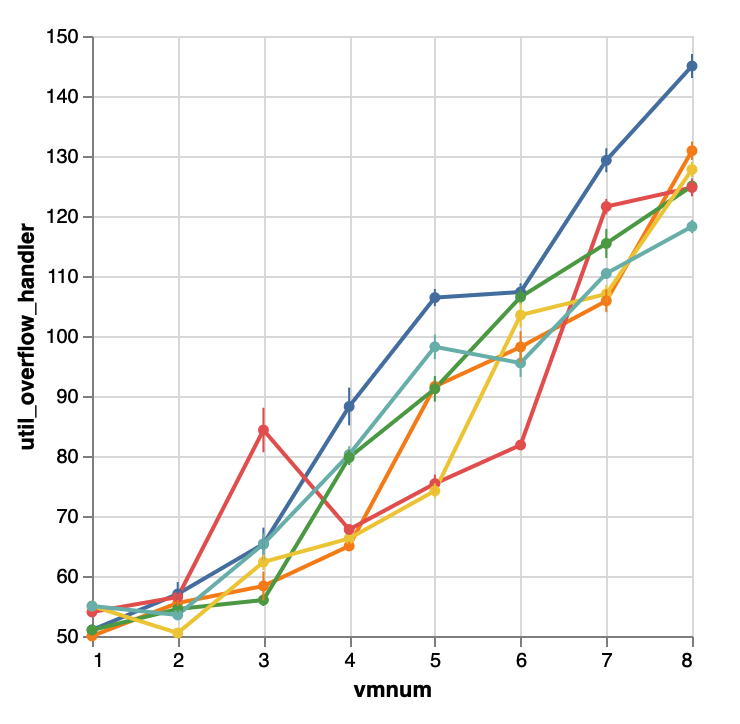
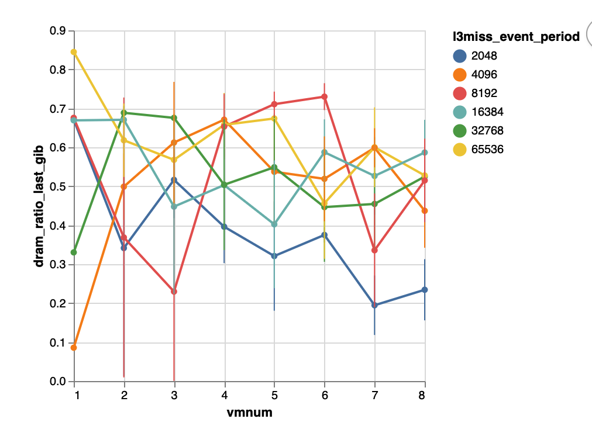
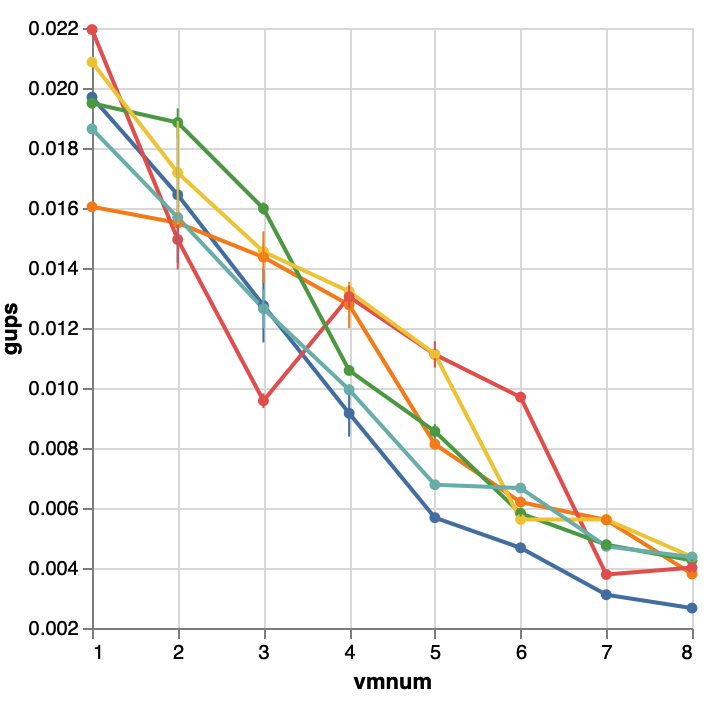
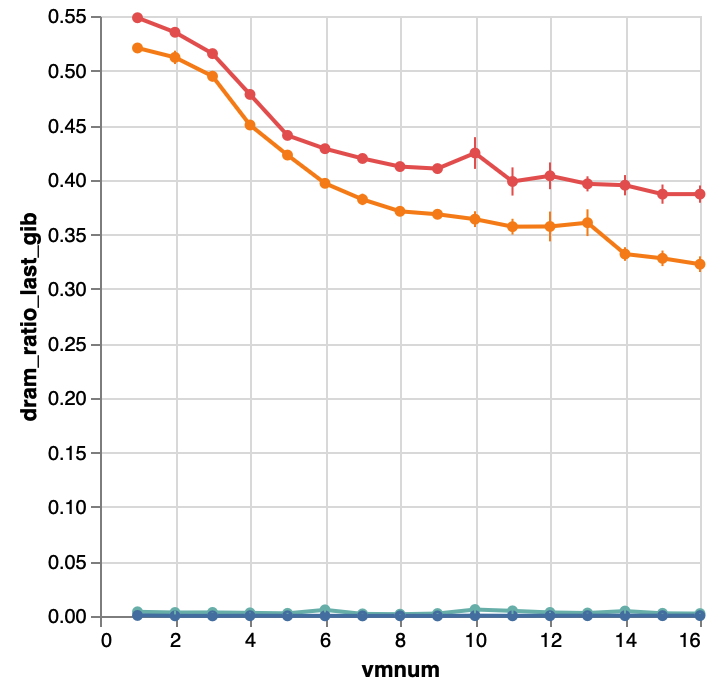
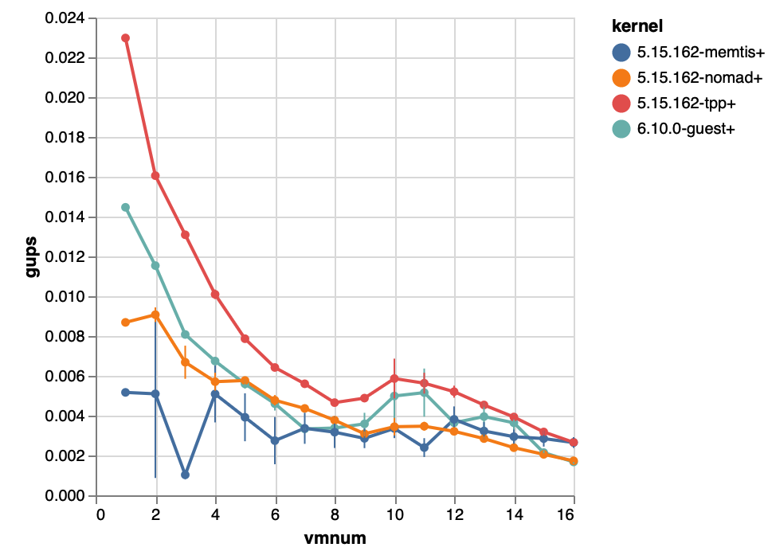

+++
+++
- Major technical contributions
  1. Hetero ballooning: motivation = overcommit is good, but balloon is not hetero aware
      - Without hb [[data](https://web.pc49058.tunnel.jlhu.io/data/projects/workspace/archive/2024-08-17T15:12:18.015459+08:00-multivm_scalability_vb-0.2-gups_hotset_reverse/)] [[figures](https://web.pc49058.tunnel.jlhu.io/data/projects/workspace/archive/2024-08-17T15:12:18.015459+08:00-multivm_scalability_vb-0.2-gups_hotset_reverse/report.html)]
        
      - With hb [[data](https://web.pc49058.tunnel.jlhu.io/data/projects/workspace/archive/2024-08-18T22:50:51.491896+08:00-multivm_scalability_hb-0.2-gups_hotset_reverse/)] [[figures](https://web.pc49058.tunnel.jlhu.io/data/projects/workspace/archive/2024-08-18T22:50:51.491896+08:00-multivm_scalability_hb-0.2-gups_hotset_reverse/report.html)]
        
  2. Affordable PEBS hotess profiling
       - Currently
          
  3. Range based hotness classfication
       - Currently [[data](https://web.pc49058.tunnel.jlhu.io/data/projects/workspace/archive/2024-10-16T12:25:43.109270+08:00-hotset_dram_ratio-score1-small_pebs_buffer/)] [[figures]](https://web.pc49058.tunnel.jlhu.io/data/projects/workspace/archive/2024-10-16T12:25:43.109270+08:00-hotset_dram_ratio-score1-small_pebs_buffer/report.html)
         
         - Previously [[data](https://web.pc49058.tunnel.jlhu.io/data/projects/workspace/archive/2024-08-20T23:28:32.128591+08:00-multivm_scalability_hb-0.2-gups_hotset_reverse-pmem/)] [[figures](https://web.pc49058.tunnel.jlhu.io/data/projects/workspace/archive/2024-08-20T23:28:32.128591+08:00-multivm_scalability_hb-0.2-gups_hotset_reverse-pmem/report.html)]
            
  4. Page exchange under memory pressure
       1. micro bench

paper layout

- motivation
  - Memtis: tune cpu overhead
- Experimental design

- Sec 4: choose some metrics
  -
