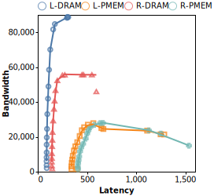

+++
+++
## [SOSP24]Colloid

这篇文章的insight是单纯将最hot的data塞到FMEM反而会降低性能.

我的理解是: 这篇文章假设memory intensive app性能表现和总内存带宽直接相关. 而SOTA这种情况下FMEM的访存过载, 而SMEM很少, 没有很好利用SMEM的带宽. 所以这篇文章提出要balance两个层的内存时延, 这样不会过载FMEM而同时能利用满SMEM的带宽, 从而达到最佳性能.

具体做法: 按照$𝑇 = \frac{𝑁 \cdot 64}{L} = \frac{N \cdot 64}{𝑝 \cdot 𝐿_D + (1−𝑝) \cdot 𝐿_𝐴}$优化每个时间片内的内存访问$N$, 使得总平均内存时延$L$最小从而达到最大吞吐$T$. 而这里总平均时延算法则是默认层/快层平均时延$L_D$和备选层/慢层平均时延$L_A$的加权平均. 想要$L$最小只需要$L_D = L_A$, 否则只需要增大或者减小hit rate $p$则可以得到更小的加权平均.

case 1: $L_D > L_A$时, 可以减小$p$, 即迁移更多hot data到SMEM.

case 2:$L_D < L_A$时, 可以增大$p$, 即迁移更多hot data到FMEM.

质疑: 对于case 2, 迁移更多hot data到FMEM真的能降低总时延么? 如果SMEM的unloaded latency就大于FMEM的loaded latency怎么办? 这时不管如何增大$p$, 即便到1也不会提升性能, 反而会使得SMEM的带宽闲置.

那么对于case 1呢? 迁移更多hot data到SMEM真的能降低总时延? 如果考虑系统处于非常紧张的状态, 即使降低了$p$, 将更多访存指向了SMEM, $L_D$也可能根本不减小, 而$L_A$却肯定会升高, 同时SMEM的带宽也有可能因为压力过大而下降.

目前这两种反例均可在以PMEM作为SMEM时观测到. 同时PMEM200也符合文中要求两个tier不共享memory channel得要求(sec1 para-2).

 [原始数据](https://gist.github.com/vtta/79903f493ce1903143aeb5e7c17810b2)

第二个质疑: “memory intensive app性能表现和总内存带宽直接相关”是否真的成立? 由lat curve可以看到在每次访存间插入≤100个delay cycle才能让L-DRAM的throughput达到80G/s. 这也意味着app每100个cycle至少访存一次内存才是intensive的. 那么现实情况究竟如何?

## 思路

目前大部份的TM系统包括我们自己都在做同一件事, 即将最hot的数据放在最fast的内存. 但是[SOSP24]Colloid提出我们其实应该朝着access latency的方向优化, 而不是单纯的识别hotness和优化placement. 这其实也让我们思考: 到底TM系统的宏观性能表现到底应该由什么指标体现? 我们优化的微观方向到底应该是什么?

我们暂且将现有这两个方向称为“hot page packing”以及“load latency balancing”. H的问题其实很严重, 首先hot的定义就是非常模糊和主观的: 访问次数最多? 频率最高? 采样中发现最多就是? 按什么时间尺度? 大小怎么定义? 再者从我们的经验来看不同的workload有着不同的访问pattern, 很难有一个准确且通用的方法去确定不同workload的hot标准. hotness这个其实算宏观概念, 并不能直接反映系统的围观表现. 举一个最极端的反例就是最hot的数据不应该都被放进了CPU cache中么, 优化hot有何意义?

而L也有问题, L的做法是调整hot data在两层间的放置, 以让两层的平均访存时延相近. L的分析指出此时能达到系统的最大内存吞吐. 但是这种方法对于L-DRAM+L-PMEM的两层无效, 因为PMEM的unloaded latency已经大于DRAM的loaded latency最大值.
