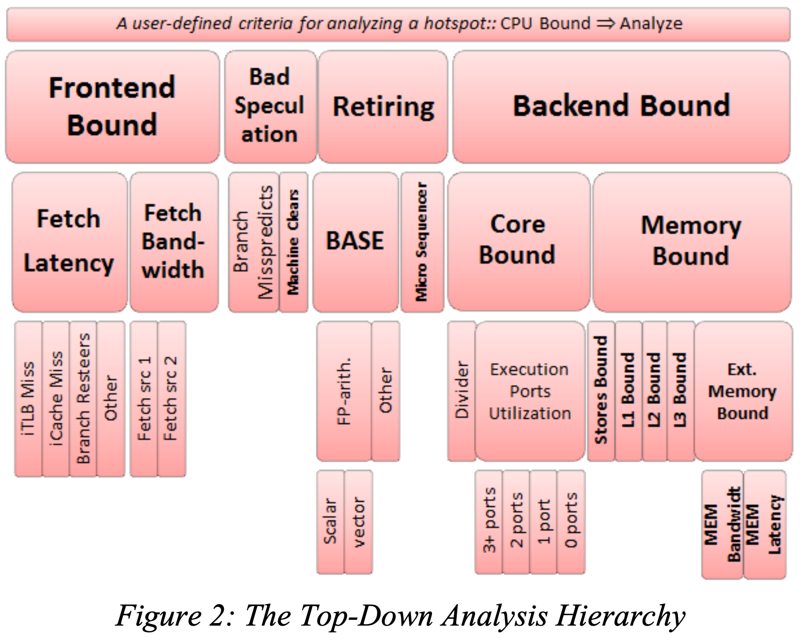
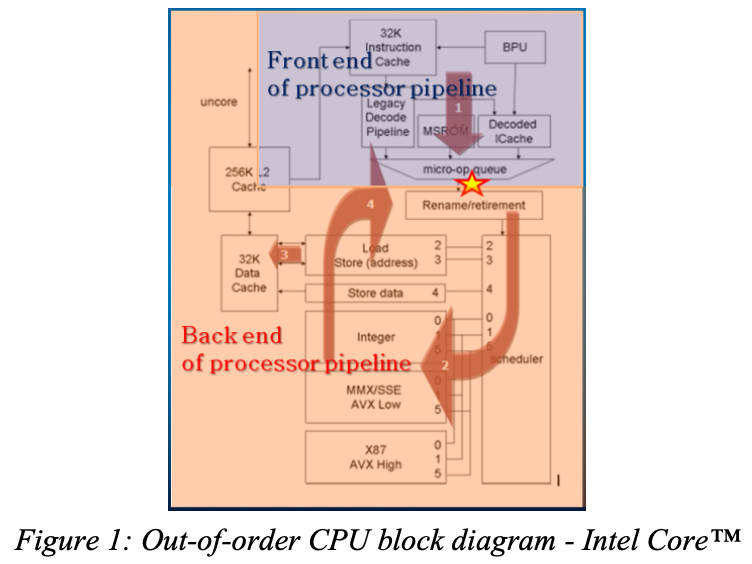
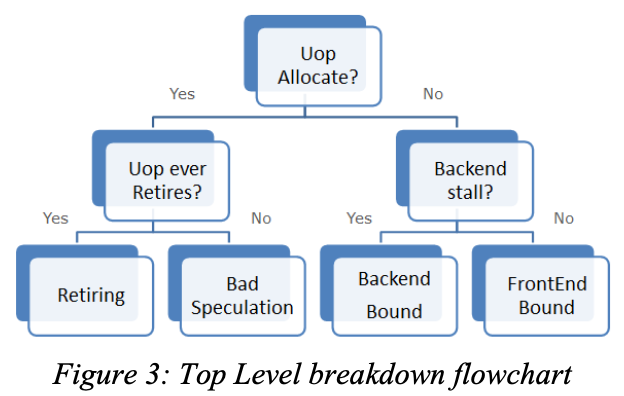

+++
+++
## vtune性能分析的入门

### TopDown方法

由于微架构的复杂性, 应用的多样性, 以及海量的数据, [TopDown方法](https://doi.org/10.1109/ISPASS.2014.6844459)被提出, 以准确且快速的检测现代处理器中的真正瓶颈.

方法是使用结构化的PMU counter统计数据.

文中的TopDown层级如下:

我们在乎的是内存相关瓶颈, 即memory bound.

同时这里也适用于我们验证colloid相关的假设: 图中支持区分到底是bw还是lat bound. colloid文章sec2.2第二点说interconnect的contention会导致slow tier的bw无法被saturate. 依照这里我们只需要看看是不是lat bound.

#### 层级的确定

由于前后端中间有一个明显的界限, 即uop issue. 如何issue了, 那么要么是retiring要么是cancelled. cancel的原因是因为branch prediction的错误. 如果没有issue, 能么则是后端产生了backpressure. 如果有backpressure则是后端的的bound, 反之则是前段跟不上后端的处理速度, 即frontend bound.

## References

- <https://zhuanlan.zhihu.com/p/11140285822>
-

