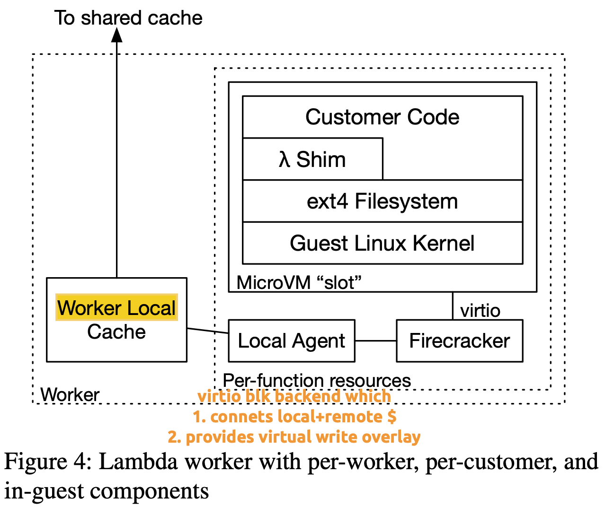

+++
+++
这篇文章关注的重点其实还是处于control path, 即“scale up time”. 这里的瓶颈在于start-up image相关的存储设施. 文章在采样VM做安全隔离的背景下, 通过virtio-blk后端连接tiered storage cache来加速本来存储在S3中的image loading.

宏观看cache由两部分组成即, AZ-level的distributed cache以及worker-level的local cache. 跟我们有相关性的主要是worker-local cache. 文中描述其实际上细分为两层, 包括flash tier以及memory tier. cache算法为LRU-k.

我们虽然可以继续按照这里的思路用tiered memory取代memory tier组成三层的local cache. 但是这里的环境我们并不好模拟, 我们需要足量的container image以及realistic的scale-up workload trace.

~~尝试关注data path: 即function invocation的throughput/latency.~~

又看到[OSDI24]Sabre以及[ASPLOS21]REAP在关注snapshot. 其实snapshot想解决的问题还是cold-startup latency. 通过加载内存镜像直接避免了系统启动以及runtime加载的时间.

目前的做法是将snapshot存储为一个文件. 启动时mmap即可. 但是这带来的后果就是运行时触碰到所需内容会有频繁的pagefault. 上述两篇文章想通过prefetching的方式来减少pagefault.

如果代入TM, 为什么不直接将slow tier作为snapshot的存储介质? 这样运行时的pagefault就被避免了. 当然代价是存储介质的价格. 这个暂且放到后面讨论, 想提升系统性能付出金钱代价肯定是必须的. 另外的副作用是pagefault其实是被转换为了page migration. 热数据会需要migrate到fast tier来提高系统性能. 但是其实slow ter的占用也是可以有优化空间的. 内存镜像中肯定有很多更不常用的数据, 这些可以沿用[ATC21]AWS中的tierd cache存储. 即将slower tier snapshot打洞, warm的data保留在slow tier. 然后最cold的数据放入tiered cache.

如果和Sabre以及REAP对比, 我们的优势应该是应用tail performance要更好. 目前Sabre以及REAP均是reproducible, 但Sabre和REAP均没有application performance的数据, 实验难度情况应该适中? 其次优化cold boot是不是本身就假设了可以牺牲data-path的performance?

如果看AWS, 他本身就使用了memory作为chunk cache, 我们使用slow memory做snapshot的“cache”也很合理. 但是问题在于我们的优势在哪里? mmap一个已经被cache的文件并访问和直接访问内存有何区别?
