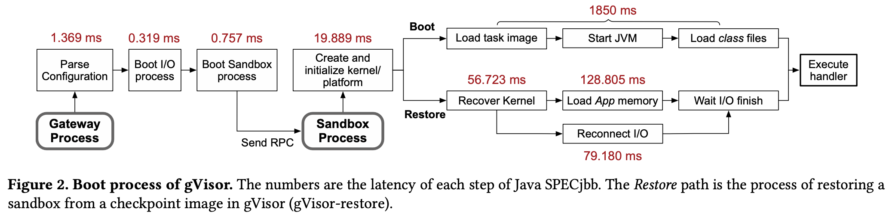
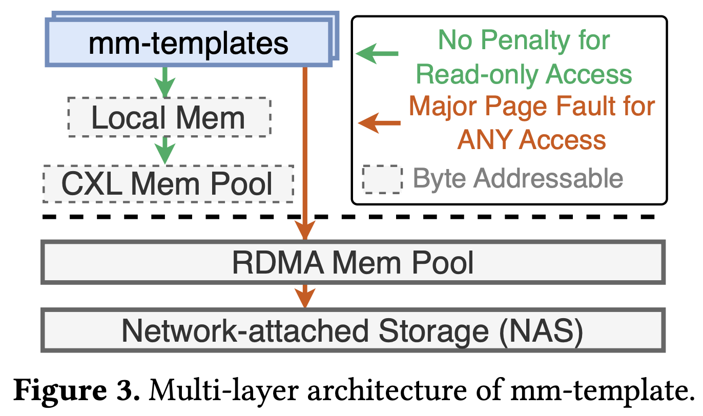

+++
+++
目前最新相关文章是[OSDI24]Sabre. 其引文之一[ASPLOS21]REAP提到第一个利用snapshot来解决cold start latency的文章是[ASPLOS20]Catalyzer.

---

## [ASPLOS20]Catalyzer

这篇文章实际上想解决两个问题: 1) isolation; 2) startup latency.

对于1), 此文是incremental work, 即继续优化virtualization-based solution. 本文虽然一直在用sandbox这个词, 但实际上还是指的是virtualization以及virtual machine. [^gVisor]

而对于2), 由SOTA描述此文是提出的是新方法, 即vm snapshot. 主要的优势在于跳过了启动时的时间开销. 此文除了传统的image-based snapshot restore还提出了reuse running sandbox的方法. 这个方法由此文提出的sfork系统调用支持.

[^gVisor]: 本文的实现也是基于google的light-weight hypervisor gVisor. 看文章中描述应该是go实现的. 更新的[OSDI24]Sabre则是基于firecracker. 其和我上一个工作中所使用的cloud-hypervisor也是同根同源, 均使用相同的底层rust-vmm库.  同时也更符合我的胃口.

即便此文并不开源但有来自蚂蚁的production system背书. 我们可以将此文当作理解现有系统架构的例子. 后续实现可能还是基于firecracker/cloud-hypervisor.

此文并没有描述production system如何存储snapshot. 此文重点是如何从snapshot启动sandbox, 即此文提到的“init-less booting”. 我们也接着来看下如果改变了snapshot的存储对上层的设计会引入那些问题以及改动.

### Startup breakdown

文章第二章通过分析startup的process来为init-less booting提供“合法性”. 此文的分析主要是以gVisor为例子, 但是应该也可以迁移到其他hypervisor-based solution.

此文第二章主要讲了三种startup time的优化方式:

1. Caching: 提前创建加载了必要运行库的语言运行时(SOCK)

   缺点: 缓存大量function可能导致内存不够; 此外对tail case的cold boot并无作用.

2. Optimized sandbox: 加快sandbox的启动时间, 比如使用light weight hypervisor.

   缺点: 可以优化OS启动, 但是对语言运行时无帮助.

3. Checkpoint and restoration: 将已经启动好的sandbox checkpoint到image. 这样加载checkpoint image即可跳过启动而直接开始serving function invocation.

   挑战: 恢复过程的实现以及优化. 此文将execute handler前所发生的事情都化为critical path. 然而CR的SOTA在此过程中需要reopen fd, reconnect IO登操作, 此文后面的设计主要想解决这里.

目前后文的细节对理解TM如何加速cold boot并没有很大帮助, 先看看其他文章.

---

## [ASPLOS21]REAP

---

## [OSDI24]Sabre

---

## [SOSP24]TrEnv

这篇文章主要想将remote mem pool引入serverless的架构. 其中考虑CXL/RDMA两种技术. 我们主要想知道他的CXL所处层级以及想解决的问题是什么.

摘要中提到贡献总共分为三点: 1) repurposable sandboxes; 2) mem template; 3) cross-node mem sharing

其中1) 看起来类似于是shared base image; 2) 不知道跟snapshot有何区别? 3) 看起来是做的集群级别的sharing, 应该跟我们想考虑的node内tiering不同.

由sec6.1看此文并没有采用hypervisor-based isolation, 而是采用了基于faasd的容器类解决方案.

尽管这篇文章避免了讨论具体的tiering方式以及算法, 但还是吃下了将CXL.mem作为“caching layer”的贡献. 这篇文章通过将VM的snapshot以mm-template的形式引入container-based solution. 优势是可以利用CXL的字节粒度可以避免copy和pagefault.

> TrEnv integrates mm-templates with both CXL and RDMA memory pools, each offering distinct advantages. Notably, to leverage the byte-addressable capabilities of CXL, mm-templates enable direct reads for read-only pages, which introduces zero additional software-level overhead during execution. Given our analysis showing that 24% to 90% of memory accesses are to read-only pages in serverless functions, this technique substantially accelerates processing times by avoiding unnecessary data copying or page faults, thereby significantly reducing latency.

---

## Serverless基础

Serverless的核心是为用户提供一个透明具有计算+存储+网络能力的运行环境(sandbox). 在目前container和hypervisor两种技术路线上计算部份基本没差. 但对于container来说, 其实存储对应的就是fd, 网络对应的就是socket.

Gain awareness of the virtual memory space?
