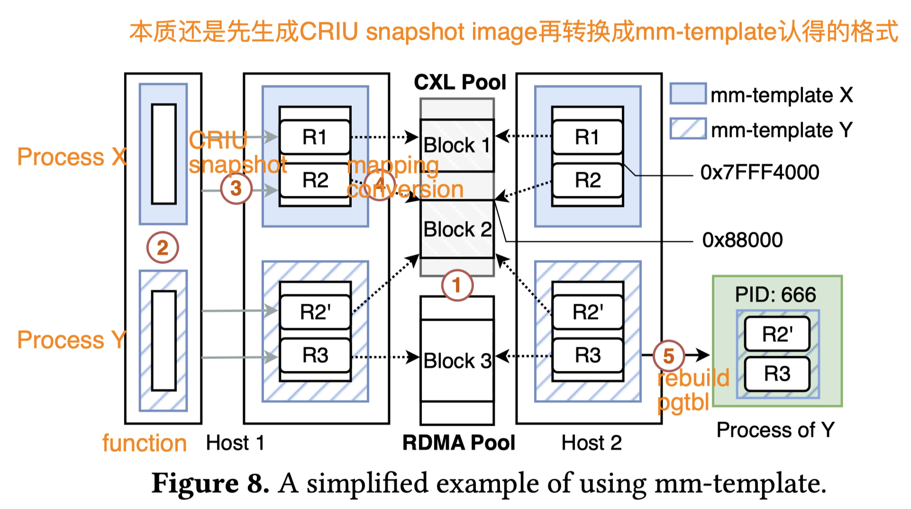
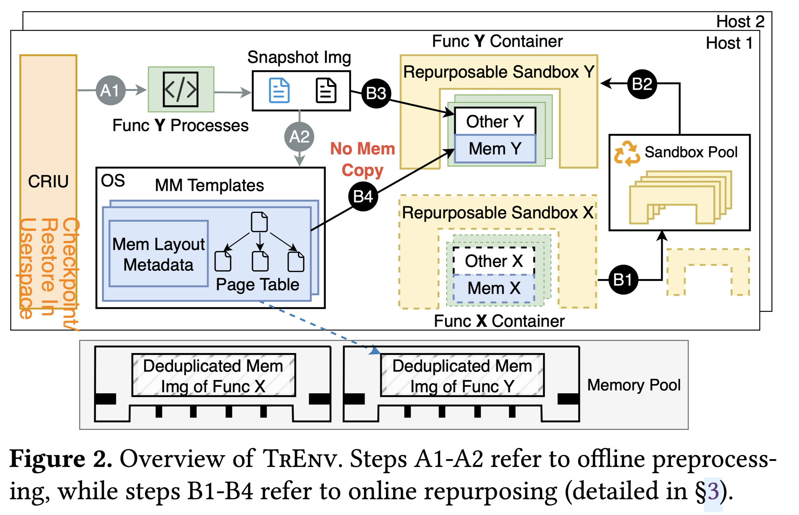

+++
+++
## [SOSP24]TrEnv

TrEnv: Transparently Share Serverless Execution Environments Across Different Functions and Nodes

#### What have they done?

Support snapshot images located on CXL.mem or RDMA

#### Storyline

***"Repurpose"***: Replace idle containers' "user-state" with in memory pool snapshot named ***"mm-template"***

