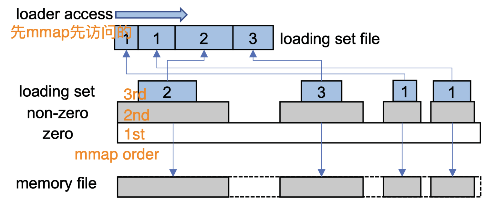
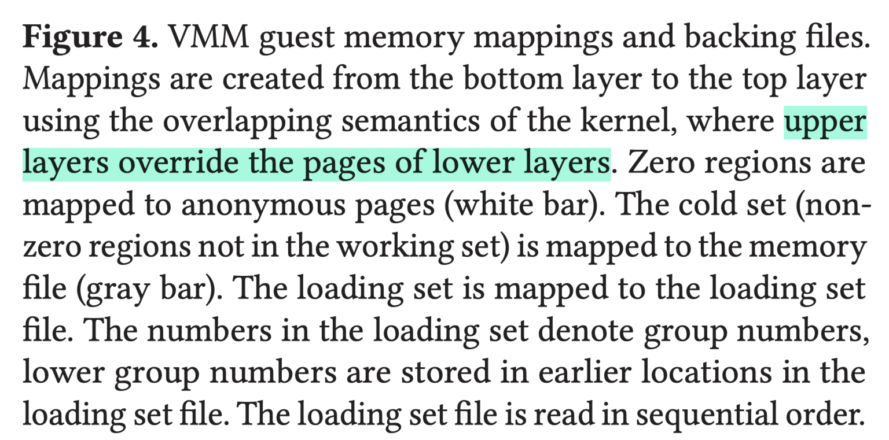

+++
+++

目前决定朝着snapshotting for tiered pooling方向走走看.

故事线上可以看看tiered pooling相关概念, 这个架构合理么? 已经有人提出过了么? 现在的发展是怎么样的?

技术上我们决定还是走microVM的线路, 这样最有可能将我们的前期工作搭上. 先从firecracker的基本snapshot支持出发, 搞清楚整个流程, 跑起来感觉一下. 之后再看看REAP/FaaSnap在其基础上的delta具体是什么. 

---

### Firecracker Snapshot Support

[doc](https://github.com/firecracker-microvm/firecracker/blob/main/docs/snapshotting/snapshot-support.md)

#### 保存

Firecracker保存的状态包括: 1)内存状态; 2)硬件状态. 最终保存下来的文件包括: 1)内存文件; 2)VM状态文件; 3)硬盘文件.

除了完整的snapshot, firecracker还支持diff mode. 这种情况下VM状态仍然会完全保存, 但是内存文件只会包含dirtied页面. 一连串的snapshot文件可以通过`snapshot-editor`工具合并. [^dirty]

[^dirty]: 这里其实暗示了dirty tracking默认是开启的. 也许hot/cold separation可以在此借力.

#### 恢复

内存通过mmap+CoW做lazy映射. 访问时才会从硬盘中读取. 另外CoW通过`MAP_PRIVATE`实现.

文档中提到了一个缺点: 内存状态文件的lifetime必须大于microVM的lifetime, 带来了额外的存储开销. 

但是学术界目前关心的主要问题还是VM启动到开始服务请求的时间. mmap的问题就是所有需要的页都要通过pagefault读入. 目前的解决方法包括: 1)预取; 2)压缩; 3)换存储介质;

---

### Catalyzer

REAP的sec2.2中提到Firecracker的设计和Catalyzer类似, 都是mmap + lazy loading via pagefault.

---

### REAP

此文贡献为: 1)一个serverless测试平台vHive; 2)基于prefetching的启动时间优化方法REAP.

Sec4.2中的观察有: 1)启动时间分Load VMM/Connection restoration/Function processing三段且第三段耗时最长, 平均多95% \[fig. 2\]; 2) pagefault是顺序处理的; 3) pagefault一般最多连续处理5页, 不太具有spatial locality (fig. 3).

这些观察体现了lazy paging带来的性能问题的重要性和优化pagefault的动机.

此外Fig. 4比较有意思, 其比较了cold boot和snapshot restore的VM内存占用, 结果发现后者平均只需要9%的内存. 这也是否意味着可以通过snapshot保持大量的后备VM从而直接抹去第一二段启动时间? 虽然文中观点认为保持大量idle fn还是浪费内存. 但是在tiered pooling背景下可能有所变数.

Fig. 5的结论是不同的输入会很大程度上使用相同的内存. 这是REcord And Prefetch的理论基础, 即记录服务第一次请求的内存作为working set, 后续restore时prefetch working set即可.

---

### FaaSnap

此文可以看作是REAP的直接后续工作. 其将自己的贡献总结为: 1) compact loading set; 2) region tailored pagefault; 3) simpler mapping process; 总之就是减少在pagefault上的用时.

对于1, 此文用loading set而不是REAP的working set主要是有两个优化: a) 去掉了0页; b) 紧凑的独立文件. (其实b不算, 因为REAP也是这么设计的) 此外对于记录的方法也有所不同, REAP的思路是通过userfaultfd截获pagefault的处理, 同时记录working set. FaaSnap则是通过连续的间接A-bit scanning获取. 这里的间接意思是不直接扫描pagetable, 而是通过`mincore`系统调用查询.

对于2, 要这么考虑的原因则是减少不必要的pagefault. 理由如下: firecracker只会将内存一次性mmap. 而对于修改0页的情况, 默认处理流程 (读内容, 复制到新页, 写入修改) 则会有额外的IO. FaaSnap这里的处理方法也很简单: 只需要将内存分类为0区和非0区. 0区直接分配新的(anon)内存, 非0区继续CoW. 为了让0页更普遍, FaaSnap也修改了kernel的allocator去0填充所有被释放的页.

对于3, 则是fix 2引入的问题, 即减少由于更细的内存划分带来的更多mmap call. 这里采用的方案则如fig. 4所示, 不采用地址顺序映射每一块区域, 而是自下向上覆盖.

---

### FaaSMem

此文在数据中心角度考虑, 用了Azure的trace. 但此文是container-based, 对container内的visibility更强.

Section 3中提到了3个观察: 1) 启动时的大量内存后续很少访问 \[类似REAP fig. 4\]; 2) 60% fn最多被访问两次, 导致cold identification非常困难; 3) 真正服务请求时所分配的内存生命周期很短暂.

基本管理思路: 分三个桶: runtime/init/exec. 不管理exec桶的访问, 其他访问分三个状态: hot/inactive/cold. 默认inactive, 第一次访问时归为hot (放入hot pool), 余下按桶内策略归为cold (即意味着需要被offload到rmem). 

runtime桶内所有的inactive页将会在服务完第一次请求后全部被归为cold. 而init桶的访问模式更受应用本身影响, 文中采取隔一个adaptive window次请求后没有访问才归为cold. 此window的取值则根据桶内页面减少的速度决定, 当速度不变时则认为找到了合适的window. 

注意这里考虑的rmem还是类似swap, 每次访问cold页都会直接被加入hot pool. 所以

---

### TrEnv

此文算是第一个引入CXL.mem的work, 但是也是基于container-based. 

此文的观察是可以区分“system state”和“user state”. 前者可以在不同Fn间共享, 后者则是Fn私有. 这样相当于撇开了启动时的“metadata”开销. 可以通过让container长期keep-alive, 需要时replace掉“user state”切换到新Fn.

此文的主要设计是将“user state”保存在CXL或者RDMA上(exclusively). 但此文并没有address其在CXL.mem上的存储的开销. 这个问题在VM-based的情况下更甚, 用户没法很好区分出“user state”, 只能全量保存内存镜像.

---

### Ours

我们考虑的环境是tiered pooling, 即同时有byte-addressable的CXL.mem, 也有传统swap-based RDMA pool. 目前的基本考虑就是如何利用好byte-addressability. 

由FaaSnap出发, 可以考虑将loading set再分为ro和rw. ro部份直接打包放入CXL.mem, 启动时就是mmap即用. rw直接启动时提前分配local DRAM, 避免copy和CoW. 另外FaaSnap遇到的mapping管理这里可能也会遇到, 因为rw可能很稀疏, 我们可能需要重新设计mmap的方式, 甚至增强kernel相关的支持. 

如果想highlight这个问题, 可以统计read/write分别触发的fault-in页数.