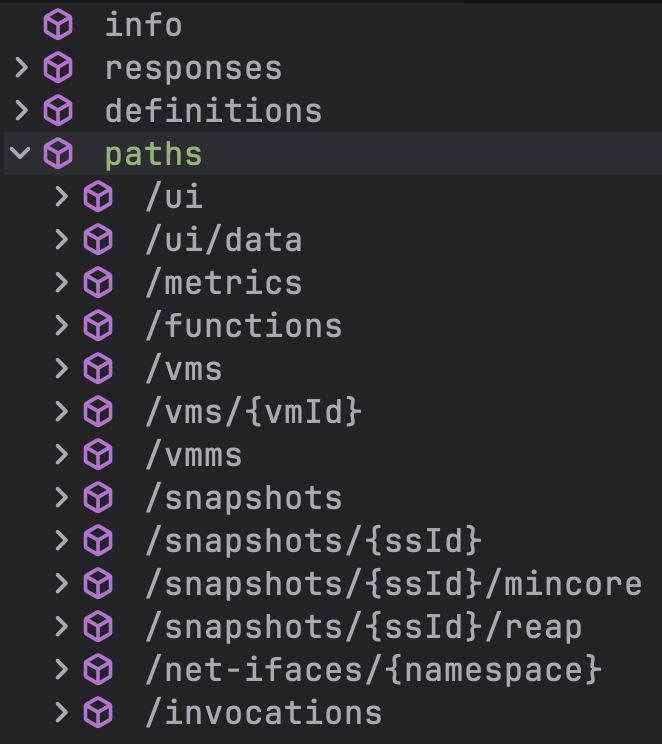
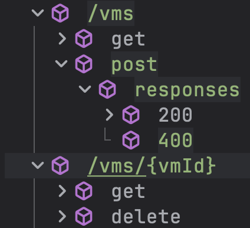

+++

+++

### FaaSnap

目前看其是自己用go+py实现了个简单的测试框架, 用来准备环境/启动VM/跑测试/抓trace. 其中有些code似乎是从[vHive](https://github.com/vhive-serverless/vHive)中复制的.

其中trace相关有用到[zipkin](https://github.com/openzipkin/zipkin)和bpftrace. 前者后面可以调查下.

---

### Fn Workloads

| Fn          | Description               | REAP (Tbl. 1) | FaaSnap (Tbl. 2) | TrEnv  (Tbl. 2) |
| ----------- | ------------------------- | ------------- | ---------------- | --------------- |
| Hello-world |                           | √             | √                |                 |
| Read-list   | read a 512MB list         |               | √                |                 |
| Mmap        | allocate anonymous memory |               | √                |                 |
| Image       | rotate a JPEG image       | √             | √                | √               |
| Json        | (de)serialize             | √             | √                | √               |
| Pyaes       | AES encryption            | √             | √                | √               |
| Chameleon   | render HTML table         | √             | √                |                 |
| Matmul      | matrix multiplication     |               | √                |                 |
| FFmpeg      | apply grayscale filter    | √             | √                | √               |
| Compression |                           |               | √                |                 |
| Recognition | PyTorch ResNet            | √             | √                | √               |
| PageRank    | igraph                    |               | √                | √               |

---

### 源码分析

先从已有知识出发: 我们想测试的是snapshot restoration time, 所以核心的东西应该包括a) VM启动; b) 打snapshot; c) snapshot恢复; d) 停止测试; e) 关键时间片的统计;

#### 测试框架

FaaSnap的测试框架整体还是C-S结构, 中间由swagger API定义连接. 从API定义出发:



可以看到我们关心的主要包括:

- VM的
  1. 创建`POST /vms`;
  2. 查询`GET /vms/{vmId}`;
  3. 删除`DELETE /vms/{vmId}`;
- Snapshot的
  1. 创建`POST /snapshots`;
  2. *复制*`PUT /snapshots`;
  3. 修改`PATCH /snapshots/{ssId}`
  4. 另外FaaSnap的mincore相关设计:
     1. 查询`GET /snapshots/{ssId}/mincore`
     2. 复制`PUT /snapshots/{ssId}/mincore`
     3. 修改`PATCH /snapshots/{ssId}/mincore`
     4. layering `POST /snapshots/{ssId}/mincore`
  5. 以及REAP的相关设计:
     1. 查询`GET /snapshots/{ssId}/reap`
     2. 修改`PATCH /snapshots/{ssId}/reap`
     3. 删除`DELETE /snapshots/{ssId}/reap`
- 函数
  1. 注册`POST /funcitons`
  2. 调用`POST /invocations`

测试代码`test.py`中的API调用:

```
# 大体流程
run -> (run_snap | run_warm)
	run_snap -> (prepareVanilla | prepareMincore | prepareReap | prepareEmuMincore) + invoke
		prepareVanilla
		prepareMincore
		prepareReap
		prepareEmuMincore
    run_warm -> invoke_warm
```

```
(run_snap)           PUT /net-ifaces/{namespace}
                     POST /functions
    (prepareVanilla) POST /vms
                     POST /invocations
                     POST /snapshots
                     DELETE /vms/{vmId}                         
                     PUT /snapshots                               
                     PATCH /snapshots/{ssId}         # drop cache
    (invoke)         POST /invocations
                     DELETE /vms/{vmId}
```

```
(run_warm)           PUT /net-ifaces/{namespace}
                     POST /functions
                     POST /vms
                     POST /invocations
    (invoke_warm)    POST /invocations
                     DELETE /vms/{vmId}
```

```
# prepareVanilla
POST /vms
POST /invocations
POST /snapshots
DELETE /vms/{vmId}                         
PUT /snapshots                               
PATCH /snapshots/{ssId}         # drop cache
```


```
# prepareMincore
POST /vms
POST /snapshots
DELETE /vms/{vmId}
PATCH /snapshots/{ssID}         # drop cache
POST /invocations
POST /snapshots
DELETE /vms/{vmId}
PUT /snapshots/{ssId}/mincore   # carry over mincore to new snapshot
PATCH /snapshots/{ssId}/mincore
PUT /snapshots/{ssId}
PATCH /snapshots/{ssID}         # drop cache
PATCH /snapshots/{ssID}         # drop cache
PATCH /snapshots/{ssId}/mincore
```

```
# prepareReap
POST /vms
POST /invocations
POST /snapshots
DELETE /vms/{vmId}
PATCH /snapshots/{ssID}         # drop cache
POST /invocations
DELETE /vms/{vmId}
PATCH /snapshots/{ssID}         # drop cache
PATCH /snapshots/{ssID}/reap    # drop reap cache
```

```
# prepareEmuMincore
POST /vms
POST /invocations
POST /snapshots
DELETE /vms/{vmId}
PATCH /snapshots/{ssID}         # drop cache
POST /invocations
DELETE /vms/{vmId}
PATCH /snapshots/{ssID}/reap    # drop reap cache
PATCH /snapshots/{ssID}/mincore 
PATCH /snapshots/{ssID}         # drop cache
```

---

目前主要关心的点是FaaSnap如何通过mincore扫描来获取loading set的?

>  从上面分析来看, 其在`prepareMincore`中两次通过`POST /snapshots`创建快照, 而其他方法均只创建了一次. 且其第二次创建快照之前触发了函数调用, 而第一次快照前并没有. 所以应该是通过两次快照之间的差距来计算出loading set.
>  注意到触发函数调用的过程中(`InvokeFunction`函数)调用了`ScanMincore`且整个代码库仅有一次调用. 可以推测这里就是loading set的创建过程. 阅读源码看到, `ScanMincore`前有判断当前snapshot的mincoreLayers是否空, 如果为空则触发`ScanMincore`. 这与刚才发现的两次快照以及触发函数后快照的行为非常吻合.
>  另外由`test.py`传入的参数`mincore=-1` (`scanInterval=-1`)可以看到实际上是调用了`ScanFileMincoreBySize`的持续扫描. 每当RSS大小增长`mincore_size`个页(1024)时扫描一次.

总结一下FaaSnap:

- 在调用函数时触发mincore扫描
- 每当RSS增长阈值大小后调用mincore扫描

>  接下来来看看REAP的实现. 阅读`InvokeFunction`代码发现其在加载快照之前通过`reap.Activate`激活了`REAP`. 此时REAP通过`FetchState`中的`fetchState`读取了内存文件, 将其预取到pagecache中. 关于REAP的working set, 其同样是在`reap.Activate`中启动的. 启动函数为`mmanger.Activate()`, 其中使用了`epoll`来异步处理`uffd` [^reapuffd]的缺页. 缺页处理函数`s.servePageFault`则在某(页)地址第一次缺页时将其记录为working set. 其记录模式类似于logging, 在每次关闭VM的时候由`ProcessRecord`函数在`writeWorkingSetPagesToFile`中回写到snapshot文件.
>  [^reapuffd]: 这里注意`uffd`其实是由修改过的firecracker注册并启动的.


总结一下REAP:

- 启动VM时
  - 通过读取到pagecache预先加载上一次记录的working set
  - 启动`uffd`的处理函数来以log形式记录触碰到的内存页地址
- 关闭VM时
  - 将所有记录到属于working set的地址对应内容写入working set文件

---

