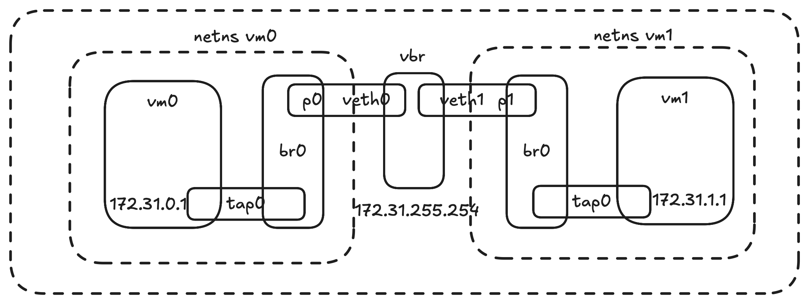

想成功运行FaaSnap的Fn需要先打通host-guest间的网络. 原因是各Fn的数据都存在一台host上的redis server. 目前已有的host-guest通信的例子就是SSH. 但是从源码来看这个实现方法是通过在uVM的netns中创建一个tap device, 并依赖这个设备与guest通信. 这个实现的特点是仅支持guest-host点对点通信, 如果想要不同guest访问同一个host地址是不可能的, 因为没法跨过每个uVM独立的netns. 

由[此文](https://www.packetcoders.io/virtual-networking-devices-tun-tap-and-veth-pairs-explained/)以及FaaSnap的实现来看, 他们都是使用了veth pair. 通过一端在每个uVM独立的netns里, 另一端在全局来实现通信.




参考这个[教程](https://github.com/frfahim/network-namespace)我们可以通过两个网桥加上veth对来将所有vm连接到一起: 首先是通过veth对, 将处于vm的netns的一段与在host netns内的一端连起来. 然后这两端分别在用两个网桥连接vm的tap device以及host的网桥. 

所需的脚本: 

```bash
# host
ip link add vbr type bridge
ip link set vbr up
ip addr add 172.31.255.254/16 dev vbr

# vm
NUM_VMS=3
for ((i=0;i<NUM_VMS;i++)); do
	veth=veth$i
	ip link add $veth type veth peer name p
	ip link set p up
	ip link set $veth up
	ip link set $veth master vbr
	netns=vm$i
	ip netns add $netns
	ip link set p netns $netns
	ip netns exec $netns ip link add br0 type bridge
	ip netns exec $netns ip link set br0 up
	ip netns exec $netns ip link set p master br0
	ip netns exec $netns ip tuntap add name tap0 mode tap
	ip netns exec $netns ip link set tap0 up
	ip netns exec $netns ip link set tap0 master br0
	ip netns exec $netns brctl show
done

brctl show
```

