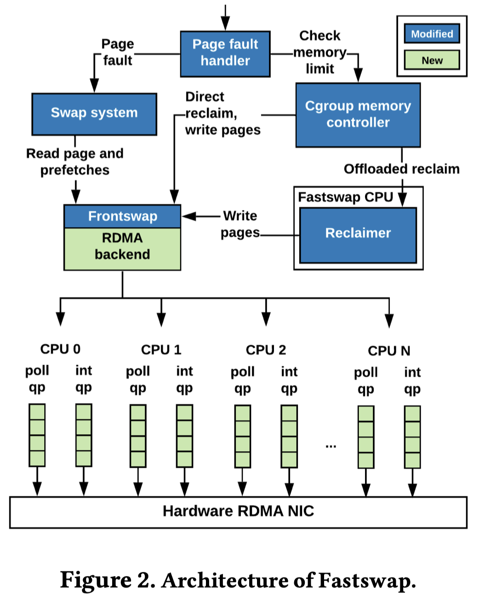
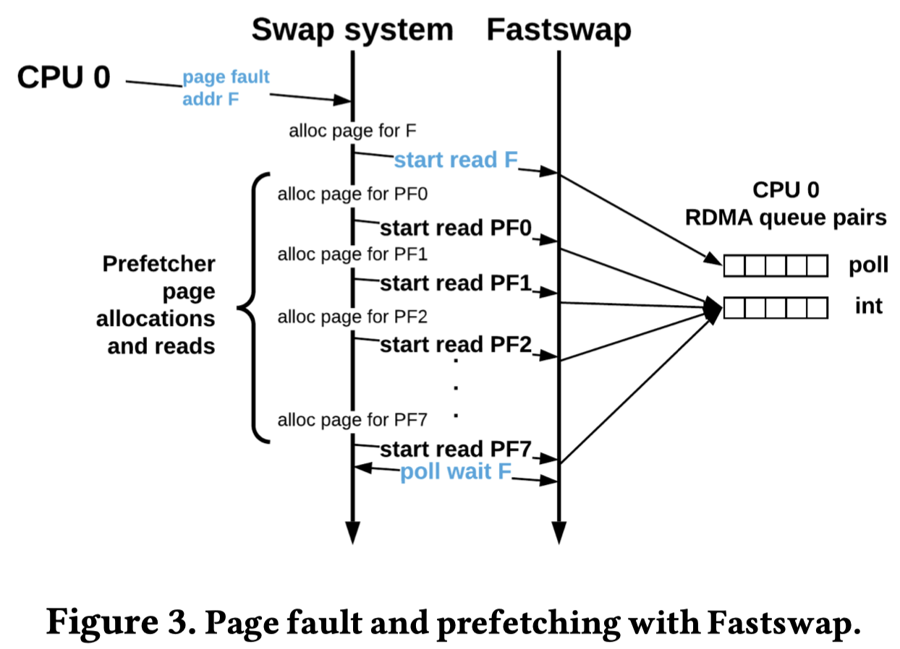

+++
+++

目前我们考虑的架构还是以CXL.mem pool最为caching layer, snapshot image实际上还是放在最底层的RDMA pool. 参考前做FaaSMem的RDMA pool是使用FastSwap实现. 由FastSwap架构可以看到其依赖于kernel组件Frontswap将RDMA backend与swap system相连. 而Frontswap组件在kernel v6.6版本中已经[惨遭移除](https://github.com/torvalds/linux/commit/42c06a0e8ebe95b81e5fb41c6556ff22d9255b0c). 我们使用的是ubuntu 24.04以及其默认的v6.8的kernel. 想要继续使用FastSwap可能会有困难. 如果降级系统不知道对网卡的驱动有何影响. 目前决定寻找替代方案.



一个比较直接的方法就是依赖于uffd, 用uffd连接用户态的RDMA swapping. 先找找相关工作 (列在了最后).

相关工作在看下来, 目前的疑惑有这些:

- [x] frontswap以及swap cache的关系到底是怎样的? Fastswap形式的remote memory到底会不会被缓存?
  - frontswap的上层是swap cache; rmem会被存在swap cache
- [x] 文件或者设备(NVMe-oF)形式的remote memory真的有人用么? 其写入过程是否也要涉及到swap cache? 是否还需要额外经过block layer?
  - 从[这里](https://www.kernel.org/doc/gorman/html/understand/understand014.html)可以得出frontswap其实和swapfile以及swap device是平行的概念. 以NVMe-oF形式存在的rmem本质属于swap device, 不仅要经过swap cache, 还要经过block layer.
  - 对比frontswap形式的rmem这种方式就太差了. 路径太长了.

---

### frontswap探秘

从frontswap存在的最后一个版本[v6.5的文档](https://www.kernel.org/doc/html/v6.5/mm/frontswap.html)中可以看到以下描述:

> Frontswap provides a "transcendent memory" interface for swap pages. In some environments, dramatic performance savings may be obtained because swapped pages are saved in RAM (or a RAM-like device) instead of a swap disk.
>
> A "load" will **copy the page**, if found, from transcendent memory **into kernel memory,** but will NOT remove the page from transcendent memory.

另外可以在frontswap的[代码](https://github.com/torvalds/linux/commit/42c06a0e8ebe95b81e5fb41c6556ff22d9255b0c#diff-0944231a8dbce9407477d40a5f368dae425fe4813d49d109d592f7ffd6fa8898L201-L202)中找到以下描述及代码:

> ```c
> /*
>  * "Get" data from frontswap associated with swaptype and offset that were
>  * specified when the data was put to frontswap and use it to fill the
>  * specified page with data. Page must be locked and in the swap cache.
>  */
> int __frontswap_load(struct page *page)
> ```
>
> ```diff
> @@ -195,7 +195,7 @@ int swap_writepage(struct page *page, struct writeback_control *wbc)
>    folio_unlock(folio);
>    return ret;
>   }
> - if (frontswap_store(&folio->page) == 0) {
> + if (zswap_store(&folio->page)) {
>    folio_start_writeback(folio);
>    folio_unlock(folio);
>    folio_end_writeback(folio);
> @@ -512,7 +512,7 @@ void swap_readpage(struct page *page, bool synchronous, struct swap_iocb **plug)
>   }
>   delayacct_swapin_start();
>  
> - if (frontswap_load(page) == 0) {
> + if (zswap_load(page)) {
>    SetPageUptodate(page);
>    unlock_page(page);
>   } else if (data_race(sis->flags & SWP_FS_OPS)) {
> ```

这两处描述表明了frontswap上层是swap cache子系统. 这也比较好理解, 就以RDMA作为frontswap的后端时为例子, 每次读取如果都要经过RDMA开销是很大的, 所以swap cache的存在可以减少一下remote access.

但是考虑我们希望能用CXL.mem做RDMA pool的cache. 而swap cache的存在让我们无从下手. 因为我们不能控制swap cache所占用的内存是从哪里来的.

---

### Fastswap相关工作

- [OSDI24]Atlas: A Tale of Two Paths: Toward a Hybrid Data Plane for Efficient Far-Memory Applications
  - 此文采用了换页以及换object两种混合策略. 两种方法的选择根据online profiling得到的locality情况决定. (AFIM+Fastswap)
- [EuroSys24]Volley: Accelerating Write-Read Orders in Disaggregated Storage
  - 此文关注的是remote storage中cache系统的evict-and-fetch的性能问题. 解决方法是并发读写. 难点在于保证读写顺序的正确性.
  - Fastswap在这里主要作为一个比较对象.
- [ASPLOS24]TrackFM: Far-out Compiler Support for a Far Memory World
  - 由标题所示, 本文是基于compiler的far memory system.
- [EuroSys23]DiLOS: Do Not Trade Compatibility for Performance in Memory Disaggregation
  - 此文是换页, 但是是在libOS中实现的. **优势在于干掉了kernel的swap cache. swap cache会缓存swap中读入的页, 并且访问swap cache会触发minor pagefault, 影响性能. (fig 1, sec 4.2)** *(这个点可以作为我们使用uffd的依据.)*
- [NSDI23]Canvas: Isolated and Adaptive Swapping for Multi-Applications on Remote Memory
  - 此文关注的是多个用户使用remote memory时的isolation问题. 解决方法是每个应用程序隔离的swap路径.
- [NSDI23]Hermit: Low-Latency, High-Throughput, and Transparent Remote Memory via Feedback-Directed Asynchrony
  - 本文关注的是基于kernel swapping的remote memory的性能以及尾延时问题. 主要的idea是将不重要的事情搬离critical path, 异步执行.
- [ATC22]DirectCXL: Direct Access, High-Performance Memory Disaggregation with D IRECT CXL
  - 此6页短文展示基于RISC-V host + FPGA prototype device的CXL.mem remote memory. 对比基于RDMA的remote memory是使用了Fastswap.
- [SOSP21]Mind: In-Network Memory Management for Disaggregated Data Centers
  - 此文将MMU的工作实现到了交换机中
- [OSDI20]Semeru: A Memory-Disaggregated Managed Runtime
  - 此文为JVM增加了remote memory的支持, 包括heap allocation以及GC; 此外也修改了kernel的remote swapping.
  - 此文的swapping是通过NVMe-oF实现, 将remote memory封装成RAM disk再交由kernel swapping.
  - 这种方法的缺点? 要经过kernel以及NVMe-oF的block layer处理. 带来额外的开销.
- [OSDI20]AIFM: High-Performance, Application-Integrated Far Memory
  - 此文以用户态库的形式提供remote memory. 主要的优点包括更小的粒度解决了换页引起的amplification.
  - 此方法的缺点? 需要使用特殊设计的remote data structure. 需要对源码进行大量修改.
- [ATC20]Leap: Effectively Prefetching Remote Memory with Leap
  - 此文是Fastswap的平行工作, 关注remote swapping的prefetch. 区别在于这里采用的是暴露为swap文件的remote memory. 其读写需要经过block layer, 而Fastswap则直接在swap系统中就将读写交给了RDMA后端, 不需要经过block layer.

---
