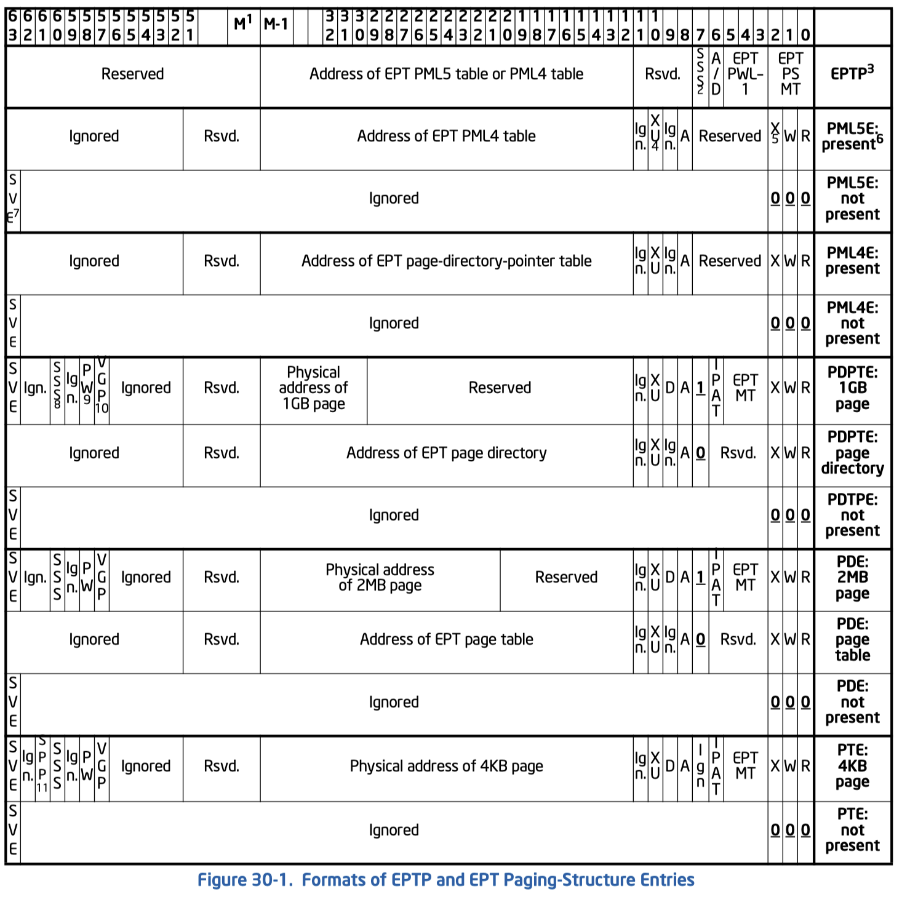

+++

+++

想知道EPT中的A bit到底是如何维护的, 今天来看看SDM. KVM中创建EPTP的代码位于`construct_eptp`, 但是其没有完整的定义. 我们概括SDM为:

```c
// EPT is aligned to 4K boundary, allowing lowest 12 bits to be packed with flags
typedef struct {
    ulong memory_type : 3; // [0, 3)  Paging structure memory type: 0 = UC/Uncacheable; 6 = WB/Write-back
    ulong walk_length : 3; // [3, 6)  EPT paging walk length: 3 = 4-level; 4 = 5-level
    ulong ad_flags    : 1; // [6, 7)  Enables accessed and dirty flags
    ulong enforce_sss : 1; // [7, 8)  Enables access rights for supervisor shadow-stack pages
    ulong __r0        : 4; // [8, 12) Reserved
    ulong addr : (M - 12); // [12, M) Physical 4K frame number of the EPT paging-structure
    ulong __r1 : (64 - M); // [M, 64) Reserved (MAXPHYADDR = host physical address length: 57/48)
} EPTP_t;
```

另外gPA被限制为52位, 不同于hPA的57位. EPTP根据`walk_length`的值指向PML5或者PML4. 每级页表entry的格式如图, 其格式可以概括为:

```c
typedef struct {

    // Part 1
    ulong read : 1;  // [0, 1) Read allowed in covered region
    ulong write : 1; // [1, 2) Write allowed in covered region
    ulong exec : 1;  // [2, 3) Instruction fetch allowed in covered region

    // Part 2 (only leaf) effective memory type is selected based on IA32_PAT and memory_type
    ulong memory_type : 3; // [3, 6) EPT memory type: 0 = UC; 1 = WC; 4 = WT; 5 = WP; 6 = WB
    ulong ignore_pat : 1;  // [6, 7) Ignore IA32_PAT and only use memory_type for effective memory type 

    // Part 3
    ulong last_level : 1; // [7, 8) Whether this entry is of the last level of EPT
    ulong accessed : 1;   // [8, 9)
    ulong dirtied : 1;    // [9, 10)
    ulong exec_user : 1;  // [10, 11)
    ulong __i0 : 1;       // [11, 12) (Seems to be used by KVM to implement shadow paging SPTE_MMU_PRESENT_MASK)
    ulong addr : (M - 12);// [12, M)
    ulong __r0 : (52 - M);// [M, 52)

    // Part 4 (only leaf)
    ulong __i1 : 5; // [52, 57)
    ulong vgp : 1; // Verify guest paging
    ulong pw : 1; // Paging-write access
    ulong __i2 : 1;
    ulong sss : 1; // Supervisor shallow stack
    ulong spp : 1; // Sub-page protect 
    ulong __i3 : 1;
    ulong sve : 1 // Supress #VE

} PTE_t;
```



 其中第一块和第三块是各级通用的, 包括了访问权限(RWXXu), 脏页控制(AD), 以及下级地址信息. 另外bit 7控制了当前entry是否是最后一级的mapping, 对于PDE/PDPTE来说就是代表是否map了一个巨页. 如果当前是最后一级那么第二块和第四块的信息也起作用. 第二块主要用来控制memory type或者是是缓存模式. 第四块则主要用来控制EPT violation (#VE)的行为, 我们基本用不到.


#### EPT-Induced VM Exits

有三种原因

1. EPT misconfiguration: 如字面意思, 就是页表有某个entry设置错误. 包括权限设置错误(W+但R-等), 或者是使用了reversed field/value.
2. EPT violation: 包括entry not present (RWX均为0); 读写权限不允许(写W-R+的页等); 以及SSS和VGP相关错误.
3. PML buffer full.

#### Accessed and Dirty Flags for EPT

EPT在每一层都有A-bit, 但是只在最后一层有D-bit. 翻译过程使用过的每一层中的A-bit都会被置位. 写gPA时翻译过程中用到的D-bit会被置位. 

特别注意的点是, 访问guest paging-structure会被视为写, 翻译时用到的EPT D-bit也会被置位. 也就是说假设读一个gVA, 通过guest pagetable每层翻译时总共会涉及到6个gPA(5级页表项的地址以及最终gPA), 翻译这些gPA用到的EPT D-bit都会被置位. 这个也好理解, 因为guest pagetable中的A-bit会被置位, 相当于写了. 那么对应的EPT D-bit也会被置位. 最后得到gPA后再通过EPT翻译则不会有D-bit被置位.

#### PML 30.3.6

PML log buffer是一个4K页. 每当任意gPA访问过程中用到的EPT D-bit被置位则CPU会将改gPA写入log. PML实际上是倒着写的, 从第511项写到0项, underflow的时候会触发PML buffer full. PML记录的gPA地址实际上是frame number, 低12位都是0, 也就是说PML的精度是页.

PML是一个位于vmcs的全局开关, 实际上没办法只tracking某个给定的区间. 

#### EPT caching

根地址翻译相关且可以被cache的结构有这些. 其中比较模糊的是Linear mapping. 怀疑实际上guest中(non-root mode)会同时存在这三种缓存, 但是SDM文中只讲了后两种存在.

| Mapping        | Translations | Paging-structure                 | Tagging     |
| -------------- | ------------ | -------------------------------- | ----------- |
| Linear         | lpn->ppn     | Every 9bit LA -> table PA [^tpa] | VPID        |
| Guest-physical | gppn->ppn    | Every 9bit gPA -> table PA       | EPTP        |
| Combined       | lpn->ppn     | Every 9bit LA -> table PA        | VPID x EPTP |

[^tpa]: 每一级都会被缓存: LA中每个用于确定哪个页表页的9bit部分都会与对应的页表页地址一起被缓存.

关于使用AD bit下如何处理TLB, SDM描述大意为修改了A/D bit则需要使用INVEPT清除所有从EPT中缓存的信息. 这会同时清除physical+combined mapping信息. 

> Software should use the INVEPT instruction with the “single-context” INVEPT type after making any of the following changes to an EPT paging-structure entry (the INVEPT descriptor should contain an EPTP value that references — directly or indirectly — the modified EPT paging structure):
>
> - Clearing bit 8 (the accessed flag) if accessed and dirty flags for EPT will be enabled.
> - For the last EPT paging-structure entry used to translate a guest-physical address (an EPT PDPTE with bit 7 set to 1, an EPT PDE with bit 7 set to 1, or an EPT PTE), clearing bit 9 (the dirty flag) if accessed and dirty flags for EPT will be enabled.
>
> Execution of the INVEPT instruction invalidates guest-physical mappings and combined mappings. Invalidation is based on instruction operands, called the INVEPT type and the INVEPT descriptor. Two INVEPT types are currently defined:
>
> - Single-context. If the INVEPT type is 1, the logical processor invalidates all guest-physical mappings and combined mappings associated with the EPTRTA specified in the INVEPT descriptor. Combined mappings for that EPTRTA are invalidated for all VPIDs and all PCIDs. (The instruction may invalidate mappings associated with other EPTRTAs.)
>
> (EPTRTA用于在nested虚拟化下tag不同的guest, 这里可以不用理会)

